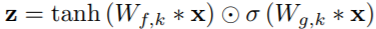
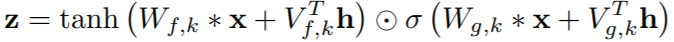

# Audio Applications

********

## Audio Generation

********
:tangerine:  [**WaveNet**](https://arxiv.org/pdf/1609.03499.pdf)   :date:   2016.09.12v1    :blush:  Google Deepmind

WaveNet: A Generative Model for Raw Audio 原始音频波形的生成模型

问题: 生成原始音频波形的神经网络;  利用联合概率分布和自回归模型, 根据之前所有音频采样数据来预测当前音频数据.

[自回归模型(Autoregressive Model)](http://geodesy.blog.sohu.com/273714573.html)是用自身做回归变量的过程，
即利用前期若干时刻的随机变量的线性组合来描述以后某时刻随机变量的线性回归模型, 它是时间序列中的一种常见形式.

思路来源于: [Pixel RNN](https://arxiv.org/abs/1601.06759) & [Exploring the Limits of Language Modeling](https://arxiv.org/abs/1602.02410)

改进: 

   生成自然的原始语音信号;
   因果多孔卷积, 具有非常大的感受野;
   单模型可以实现生成不同的声音;
   同样的架构可以用于多个应用, TTS, 语音增强, 声音转换, 声源分离等.

思路: 

      声波联合概率x={x1, ..., xT} 可以分解为条件概率的积: (xt是t时间内的所有样本)
      
      条件概率分布可以构建成卷积层的堆叠, 没有池化层, 输入和输出的时间长度相同. 输出层为softmax + categorical distribution. 

      ------
      
      WaveNet的主要成分是: 因果多孔卷积; 像语音信号这样的一维数据, 数据切换几个时间单位就可以了. 并没有使用RNN, 训练会快一些, 尤其是长信号.
      因果多孔卷积的一个问题是 需要增加层数 或者 更大的滤波器 来增加感受野. 如下感受野为5: (层数+滤波器大小-1). 也可以增加孔的大小来增加感受野.
   
      举例: 因果多孔卷积的孔分别为1, 2, 4, 8. 
   
      WaveNet的多孔配置是: 1,2,4,...,512,1,2,4,...,512,1,2,4,...,512. 幂级数增长的多孔感受野为1024,可以看作是1x1024卷积; 多层堆叠增加了模型容量和感受野大小.
      训练阶段, 所有的时间信号可以并行输出, 因为ground truth都是已知的. 但推断的时候则是顺序的, 预测的每个样本再送入模型预测下一个样本.
      
      ------
      
      SoftMax Distribution: 柔性最大化分布比条件高斯混合更好, 因为categorical分布更具弹性, 更容易输出任意概率. 
      原始语音信号是16位整型, softmax层可以输出65536个概率值.WaveNet对语音信号进行μ law变换, 256量化; 非线性量化重构效果显然优于线性量化算法.
      
      ------
      
      门控激活:与PixelCNN激活单元形同
   
      ∗ 是卷积操作; ⊙是元素相乘; σ(·) sigmoid函数; k层数, f滤波器, g门控,W待学参数
      
      ------
      
      残差和跳层连接:
   
   
      
      ------
      
      Conditional WaveNet: 类似cGAN, 条件控制需要的特征; 
      全局条件是控制所有时间序列的分布输出,比如说话人嵌入的TTS模型: 
   
      局部条件是比原始语音更低频率的序列, 用转置卷积转换后与原始语音信号相同频率后送入激活单元
   

#### Network

   

   Layer3-10 形成一个block, 这样 block 有 15个。 
   这些 block 的区别就是dilation 不同。 
   dialtion 从1, 2, 4, 8, 16 这样改变，重复三次， 就是15个block.

   

#### Loss Function

   用于ASR的Loss Funcation
   

   激活单元的tanh和sigmoid一起使用: 语音信号在[-1, 1]之间, 希望输出[-1, 1], 如果ReLU, 就没有小于零的部分.

   CTC( Connectionist Temporal Classification) Loss

#### Implementation 

-   [Pix2Pix + BEGAN PyTorch](https://github.com/taey16/pix2pixBEGAN.pytorch)

-  [Pix2Pix Keras](https://github.com/tdeboissiere/DeepLearningImplementations/tree/master/pix2pix)

#### Reference

- [CTC Loss理解](https://www.cnblogs.com/Allen-rg/p/9720768.html)

- [文字识别中CTC损失的直觉解释](https://mp.weixin.qq.com/s?__biz=Mzg5ODAzMTkyMg==&mid=2247486359&idx=1&sn=a6fb6cc2d201abdba19a78da6df91002&chksm=c06983caf71e0adc72de45d785194d48b063c2523a54b6725f2ac5f08ebbc89d9d107a67d1c2&scene=27#wechat_redirect)

- [CTC loss从理论到训练](https://blog.csdn.net/justsolow/article/details/105251789)

- [Speech-to-Text-WaveNet](https://github.com/buriburisuri/speech-to-text-wavenet)

- [语音合成/识别 WaveNet](https://www.jianshu.com/p/bb13ae73e427)

********

:tangerine:  [**WaveRNN**](https://arxiv.org/pdf/1802.08435v1.pdf)   :date:   2018.02.23v1    :blush:  Cornell University / NVidia

Efficient Neural Audio Synthesis

#### Network 

    

#### Implementation 

-  

- 

- 

-    

#### Reference 

********

:tangerine:  [**Real-Time Voice Cloning**](https://matheo.uliege.be/bitstream/2268.2/6801/5/s123578Jemine2019.pdf)   :date:   2019.06.27v1    :blush:  里昂大学（Université de Lyon）

Real-time Voice Cloning

#### Network 

    3

#### Implementation 

-  

- 

-  [Real-Time-Voice-Cloning](https://github.com/CorentinJ/Real-Time-Voice-Cloning)

-    

#### Reference 

********

:tangerine:  [**Tacotron**](https://arxiv.org/pdf/1712.05884.pdf)   :date:   2017.03.29v1    :blush:  Google

Tacotron: Towards End-to-End Speech Synthesis

#### Network 

    

CBHG Module

#### Implementation 

-   [Tacotron2](https://github.com/NVIDIA/tacotron2)

- 

-  

-    

#### Reference 

********

:tangerine:  [**Tacotron2**](https://arxiv.org/pdf/1712.05884.pdf)   :date:   2017.12.16v1    :blush:  Google

Natural TTS Synthesis By Conditioning Wavenet On Mel Spectrogram Predictions

#### Network 

    

#### Implementation 

-   [Tacotron2](https://github.com/NVIDIA/tacotron2)

- 

-  

-    

#### Reference 

********

:tangerine:  [**Speaker Verification to Multispeaker TTS**](https://arxiv.org/pdf/1806.04558.pdf)   :date:   2018.06.12v1    :blush:  Google

Transfer Learning from Speaker Verification to Multispeaker Text-To-Speech Synthesis

#### Network 

    

#### Implementation 

-  

- 

-  [Real-Time-Voice-Cloning](https://github.com/CorentinJ/Real-Time-Voice-Cloning)

-    

#### Reference 

- [语音中的风格转换](https://www.cnblogs.com/mengnan/p/10294884.html)

********

:tangerine:  [**BicycleGAN**](https://arxiv.org/pdf/1711.11586.pdf)   :date:   2017.11v1    :blush:  UC Berkeley / Adobe Research

Toward Multimodal Image-to-Image Translation

#### Network 

    

#### Implementation 

-   [BicycleGAN Official PyTorch](https://github.com/junyanz/BicycleGAN)

- 

- 

-    

#### Reference 

********
:tangerine:  [**MUNIT**](https://arxiv.org/pdf/1804.04732.pdf)   :date:   2018.04v1    :blush:  Cornell University / NVidia

MUNIT: Multimodal UNsupervised Image-to-image Translation

#### Network 

    

#### Reference 

-    [MUNIT - NVidia Official PyTorch](https://github.com/NVlabs/MUNIT)

-  [MUNIT - Keras](https://github.com/shaoanlu/MUNIT-keras)

-  [MUNIT - tensorflow1.4](https://github.com/taki0112/MUNIT-Tensorflow)

-  

********

:tangerine:  [**StarGAN v1**](https://arxiv.org/pdf/1711.09020.pdf)   :date:   2017.11.24v1    :blush:  Korea University / Clova AI Research

StarGAN: Unified Generative Adversarial Networks for Multi-Domain Image-to-Image Translation

#### Network 

    

    

#### Reference 

-    [StarGAN v1 Official PyTorch](https://github.com/yunjey/stargan)

-  [StarGAN v1 - Keras](https://github.com/hoangthang1607/StarGAN-Keras)

-  [StarGAN v1 - tensorflow1.8](https://github.com/taki0112/StarGAN-Tensorflow)

-  

********

:tangerine:  [**StarGAN v2**](https://arxiv.org/pdf/1912.01865.pdf)   :date:   2019.12.04v1    :blush:  Clova AI Research

StarGAN v2: Diverse Image Synthesis for Multiple Domains

#### Network 

    

    

#### Reference 

-    [StarGAN v2 Official PyTorch](https://github.com/clovaai/stargan-v2)

-  

-  

-  [StarGAN v2 - tensorflow2.1](https://github.com/clovaai/stargan-v2-tensorflow)

## Speech Separation and Extraction

********

:tangerine:  [**Voice Separation with an Unknown Number of Multiple Speakers**](https://arxiv.org/pdf/2003.01531.pdf)   :date:   2020.02.29v1    :blush:  Facebook

Voice Separation with an Unknown Number of Multiple Speakers

#### Network 

    

#### Implementation

-    [SPADE Official PyTorch](https://github.com/NVlabs/SPADE)

#### Reference 

- [Speech Separation and Extraction via Deep Learning](https://github.com/gemengtju/Tutorial_Separation)

- [Project Homepage](https://enk100.github.io/speaker_separation/)

********

:tangerine:  [**U-GAN-IT**](https://arxiv.org/pdf/1907.10830.pdf)   :date:   2019.07v1

#### Loss Function 

   - Adaptive Layer-Instance Normalization (AdaLIN)

      Combine the advantages of AdaIN and LN by selectively keeping or changing the content information
      选择或改变特定内容信息,融合了AdaIN和LN的优势

#### Network 

    

#### Implementation 

-   [FID PyTorch](https://github.com/mseitzer/pytorch-fid)

- 

- 

-    

