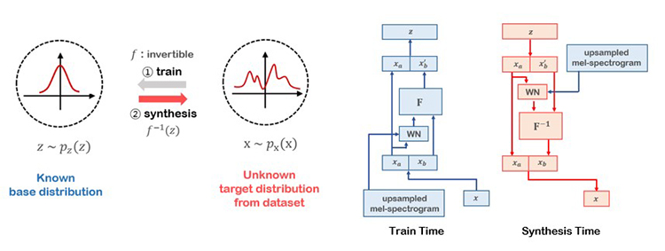

# Audio Applications

---

## Attention

---

:tangerine:  [**Attention Alignment**](https://arxiv.org/pdf/1409.0473.pdf)   :date:   2014.09.01v1    :blush:  Universite de Montr´eal

Neural Machine Translation by Jointly Learning to Align and Translate

Bahdanau Attention Overview

注意力机制的整体流程:

1. 解码器隐藏状态和编码器输出都有单独线性层，具有可训练权重

2. 解码器隐藏状态添加到编码器输出中, 然后通过 *tanh* 激活

3. 前几个步骤计算的结果向量经过矩阵乘法与可训练的向量，获得最终对齐分数向量，该向量为每个编码器输出提供分数。

4. 生成对齐分数向量后，在此向量上使用 softmax 以获得注意力权重。

5. 获得注意力权重后，可以使用编码器输出对注意力权重进行元素乘加生成上下向量。由于前一步softmax，如果特定输入元素的分数接近 1，则其对解码器输出的影响会放大; 如果分数接近 0，则其影响被淹没并无效。

6. 上下文向量将与前一个解码器输出进行级联，送入解码器 LSTM cell 产生新的隐藏状态。重复之前的流程，最终输出通过把隐藏状态送入线性层分类器，提供下一个预测单词的概率分数。

#### Reference

- [Attention-Mechanism](https://blog.floydhub.com/attention-mechanism/)

---

:tangerine:  [**Attention RNN**](https://arxiv.org/pdf/1506.07503.pdf)   :date:   2015.06.24v1    :blush:  Universite de Montr´eal

Attention-Based Models for Speech Recognition

---

## Speech Synthesis

---

:tangerine:  [**WaveNet**](https://arxiv.org/pdf/1609.03499.pdf)   :date:   2016.09.12v1    :blush:  Google Deepmind

WaveNet: A Generative Model for Raw Audio 原始音频波形的生成模型

问题: 生成原始音频波形的神经网络;  利用联合概率分布和自回归模型, 根据之前所有音频采样数据来预测当前音频数据.

[自回归模型(Autoregressive Model)](http://geodesy.blog.sohu.com/273714573.html)是用自身做回归变量的过程，
即利用前期若干时刻的随机变量的线性组合来描述以后某时刻随机变量的线性回归模型, 它是时间序列中的一种常见形式.

思路来源于: [Pixel RNN](https://arxiv.org/abs/1601.06759) & [Exploring the Limits of Language Modeling](https://arxiv.org/abs/1602.02410)

改进: 

   生成自然的原始语音信号;
   因果多孔卷积, 具有非常大的感受野;
   单模型可以实现生成不同的声音;
   同样的架构可以用于多个应用, TTS, 语音增强, 声音转换, 声源分离等.

思路: 

      声波联合概率x={x1, ..., xT} 可以分解为条件概率的积: (xt是t时间内的所有样本)
     

      条件概率分布可以构建成卷积层的堆叠, 没有池化层, 输入和输出的时间长度相同. 输出层为softmax + categorical distribution. 
    
   ------
      
      WaveNet的主要成分是: 因果多孔卷积; 像语音信号这样的一维数据, 数据切换几个时间单位就可以了. 并没有使用RNN, 训练会快一些, 尤其是长信号.
      因果多孔卷积的一个问题是 需要增加层数 或者 更大的滤波器 来增加感受野. 如下感受野为5: (层数+滤波器大小-1). 也可以增加孔的大小来增加感受野.
   

      举例: 因果多孔卷积的孔分别为1, 2, 4, 8. 
   

      WaveNet的多孔配置是: 1,2,4,...,512,1,2,4,...,512,1,2,4,...,512. 幂级数增长的多孔感受野为1024,可以看作是1x1024卷积; 
      多层堆叠增加了模型容量和感受野大小.
      训练阶段, 所有的时间信号可以并行输出, 因为ground truth都是已知的. 
      但推断的时候则是顺序的, 预测的每个样本再送入模型预测下一个样本.
      
 
      
      SoftMax Distribution: 柔性最大化分布比条件高斯混合更好, 因为categorical分布更具弹性, 更容易输出任意概率. 
      原始语音信号是16位整型, softmax层可以输出65536个概率值.WaveNet对语音信号进行μ law变换, 256量化; 非线性量化重构效果显然优于线性量化算法.
      

      
      门控激活:与PixelCNN激活单元形同
   

      ∗ 是卷积操作; ⊙是元素相乘; σ(·) sigmoid函数; k层数, f滤波器, g门控,W待学参数
      

      
      残差和跳层连接:
   
   
      

      
      Conditional WaveNet: 类似cGAN, 条件控制需要的特征; 
      全局条件是控制所有时间序列的分布输出,比如说话人嵌入的TTS模型: 
   

      局部条件是比原始语音更低频率的序列, 用转置卷积转换后与原始语音信号相同频率后送入激活单元
   

      Text-to-Mel 网络生成的输出称为 Mel-Spectrogram，而不是语音。
      梅尔光谱是分析语音频率特征的数据。Mel频谱非常有效地组织语音数据的关键信息。
      但无法立即将梅尔频谱转换为语音，需要使用 Vocoder 将梅尔频谱转换为语音数据。
      神经神经编码器（Neural Vocoder）利用神经网络从语音特征（如梅尔光谱）中产生语音。

      Wavenet 神经编码器模型，是一种自回归模型，使用语音样本之间的顺序特征。
      Wavenet 使用前一个样本成功合成高质量的语音，预测下一个样本。
      但是，从前面的样本中逐个生成下一个样本，生成速度非常缓慢。

#### Network

Layer3-10 形成一个block, 这样 block 有 15个。
这些 block 的区别就是dilation 不同。
dialtion 从1, 2, 4, 8, 16 这样改变，重复三次， 就是15个block.

#### Loss Function

用于ASR的Loss Funcation

激活单元的tanh和sigmoid一起使用: 语音信号在[-1, 1]之间, 希望输出[-1, 1], 如果ReLU, 就没有小于零的部分.

CTC( Connectionist Temporal Classification) Loss

#### Implementation

-   [Pix2Pix + BEGAN PyTorch](https://github.com/taey16/pix2pixBEGAN.pytorch)
-  [Pix2Pix Keras](https://github.com/tdeboissiere/DeepLearningImplementations/tree/master/pix2pix)

#### Reference

- [CTC Loss理解](https://www.cnblogs.com/Allen-rg/p/9720768.html)
- [文字识别中CTC损失的直觉解释](https://mp.weixin.qq.com/s?__biz=Mzg5ODAzMTkyMg==&mid=2247486359&idx=1&sn=a6fb6cc2d201abdba19a78da6df91002&chksm=c06983caf71e0adc72de45d785194d48b063c2523a54b6725f2ac5f08ebbc89d9d107a67d1c2&scene=27#wechat_redirect)
- [CTC loss从理论到训练](https://blog.csdn.net/justsolow/article/details/105251789)
- [Speech-to-Text-WaveNet](https://github.com/buriburisuri/speech-to-text-wavenet)
- [语音合成/识别 WaveNet](https://www.jianshu.com/p/bb13ae73e427)

---

:tangerine:  [**Parallel WaveNet**](https://arxiv.org/pdf/1711.10433.pdf)   :date:   2017.11.28v1    :blush:  Google

Parallel WaveNet: Fast High-Fidelity Speech Synthesis

      Parallel Wavenet 改善 Wavenet 缓慢的样本生成速度。
      Parallel Wavenet 使用 Inverse Autoregressive Flow （IAF） 模型合成语音。
      IAF 模型在训练时不知道目标语音数据集的分布情况，
      因此使用训练好的 Wavenet 提取目标数据集的分布信息，将其与 IAF 模型中的结果值进行比较。

      Parallel Wavenet 使用的 IAF 模型称为 student network，Wavenet 模型称为 teacher network。
      Parallel Wavenet 优势是语音合成速度比 Wavenet 快。
      但缺点是，合成语音的质量不如 Wavenet，并且需要训练 teacher network。

#### Network

#### Implementation

- 
- 
- 
- 

#### Reference

[end-to-end-speech-synthesis](https://blog.ncsoft.com/end-to-end-speech-synthesis-2/)

---

:tangerine:  [**WaveRNN**](https://arxiv.org/pdf/1802.08435v1.pdf)   :date:   2018.02.23v1    :blush:  Cornell University / NVidia

Efficient Neural Audio Synthesis

Text-to-Speech Synthesis: TTS 应用

WaveRNN:

- 单层RNN，双 softmax 层，预测16bit audio sample;  GPU 4x 实时
- 使用了权重剪枝

#### Network

#### Implementation

- 
- 
- 
- 

#### Reference

[LSTM和GRU图解](http://www.atyun.com/30234.html)

---

:tangerine:  [**Real-Time Voice Cloning**](https://matheo.uliege.be/bitstream/2268.2/6801/5/s123578Jemine2019.pdf)   :date:   2019.06.27v1    :blush:  里昂大学（Université de Lyon）

Real-time Voice Cloning

#### Network

 3

#### Implementation

- 
- 
-  [Real-Time-Voice-Cloning](https://github.com/CorentinJ/Real-Time-Voice-Cloning)
- 

#### Reference

---

:tangerine:  [**Tacotron**](https://arxiv.org/pdf/1712.05884.pdf)   :date:   2017.03.29v1    :blush:  Google

Tacotron: Towards End-to-End Speech Synthesis

#### Network

CBHG Module

#### Implementation

-   [Tacotron2](https://github.com/NVIDIA/tacotron2)
- 
- 
- 

#### Reference

- [end-to-end speech synthesis system by Google](https://google.github.io/tacotron/)
- [注意力机制](https://blog.floydhub.com/attention-mechanism/)
- [PyTorch 编写 Transformer](https://blog.floydhub.com/the-transformer-in-pytorch/)

---

:tangerine:  [**Tacotron2**](https://arxiv.org/pdf/1712.05884.pdf)   :date:   2017.12.16v1    :blush:  Google

Natural TTS Synthesis By Conditioning Wavenet On Mel Spectrogram Predictions

#### Network 

    

      Tacotron2(

      (embedding): Embedding(148, 512)

      (encoder): **Encoder**( 

      ​    (convolutions): ModuleList(

      ​      (0): Sequential((0): ConvNorm((conv): Conv1d(512, 512, kernel_size=(5,), stride=(1,), padding=(2,)) )
      ​        	        (1): BatchNorm1d(512, eps=1e-05, momentum=0.1, affine=True, track_running_stats=True))

      ​      (1): Sequential((0): ConvNorm((conv): Conv1d(512, 512, kernel_size=(5,), stride=(1,), padding=(2,)))
      ​                      (1): BatchNorm1d(512, eps=1e-05, momentum=0.1, affine=True, track_running_stats=True))

      ​      (2): Sequential((0): ConvNorm((conv): Conv1d(512, 512, kernel_size=(5,), stride=(1,), padding=(2,)))
      ​                      (1): BatchNorm1d(512, eps=1e-05, momentum=0.1, affine=True, track_running_stats=True)))

      ​    (lstm): LSTM(512, 256, batch_first=True, bidirectional=True))

      (decoder): **Decoder**(

      ​    (prenet): Prenet(  (layers): ModuleList(
      ​        (0): LinearNorm( (linear_layer): Linear(in_features=80, out_features=256, bias=False)    )
      ​        (1): LinearNorm( (linear_layer): Linear(in_features=256, out_features=256, bias=False)  )    )      )

      ​    (attention_rnn): LSTMCell(768, 1024)

      ​    (attention_layer): Attention(

      ​      (query_layer):  LinearNorm( (linear_layer): Linear(in_features=1024, out_features=128, bias=False)  )

      ​      (memory_layer): LinearNorm( (linear_layer): Linear(in_features=512,  out_features=128, bias=False)   )

      ​      (v):            LinearNorm( (linear_layer): Linear(in_features=128,   out_features=1,    bias=False)	)

      ​      (location_layer): LocationLayer(

      ​        (location_conv): ConvNorm((conv): Conv1d(2, 32, kernel_size=(31,), stride=(1,), padding=(15,), bias=False) )

      ​        (location_dense): LinearNorm((linear_layer): Linear(in_features=32, out_features=128, bias=False) )))

      ​    (decoder_rnn): LSTMCell(1536, 1024, bias=1)

      ​    (linear_projection): LinearNorm(  (linear_layer): Linear(in_features=1536, out_features=80, bias=True)  )

      ​    (gate_layer): LinearNorm(  (linear_layer): Linear(in_features=1536, out_features=1, bias=True)  )     )

      (postnet): Postnet(

      ​    (convolutions): ModuleList(

      ​      (0): Sequential((0): ConvNorm((conv): Conv1d(80, 512, kernel_size=(5,), stride=(1,), padding=(2,))   )

      ​       (1): BatchNorm1d(512, eps=1e-05, momentum=0.1, affine=True, track_running_stats=True)  )

      ​      (1): Sequential((0): ConvNorm((conv): Conv1d(512, 512, kernel_size=(5,), stride=(1,), padding=(2,))  )

      ​        (1): BatchNorm1d(512, eps=1e-05, momentum=0.1, affine=True, track_running_stats=True)  )

      ​      (2): Sequential((0): ConvNorm((conv): Conv1d(512, 512, kernel_size=(5,), stride=(1,), padding=(2,))   )

      ​        (1): BatchNorm1d(512, eps=1e-05, momentum=0.1, affine=True, track_running_stats=True)   )

      ​      (3): Sequential((0): ConvNorm((conv): Conv1d(512, 512, kernel_size=(5,), stride=(1,), padding=(2,))    )

      ​        (1): BatchNorm1d(512, eps=1e-05, momentum=0.1, affine=True, track_running_stats=True)    )
      

      ​      (4): Sequential((0): ConvNorm((conv): Conv1d(512, 80, kernel_size=(5,), stride=(1,), padding=(2,))      )

      ​       (1): BatchNorm1d(80, eps=1e-05, momentum=0.1, affine=True, track_running_stats=True)     )   )    )

      )

#### Implementation

-   [Tacotron2](https://github.com/NVIDIA/tacotron2)
- 
- 
- 

#### Reference

- [Understanding LSTM Networks](http://colah.github.io/posts/2015-08-Understanding-LSTMs/)
- [PyTorch中的nn.Conv1d与nn.Conv2d](https://www.jianshu.com/p/45a26d278473)
- [nn.Conv1D](https://blog.csdn.net/Elva_23/article/details/83826587)
- [循环神经网络 – Recurrent Neural Network | RNN](https://easyai.tech/ai-definition/rnn/)
- [Keras Conv1D Layer](https://keras.io/api/layers/convolution_layers/convolution1d/)
- [PyTorch Conv1D](https://pytorch.org/docs/stable/generated/torch.nn.Conv1d.html)
- [How to Deploy Real-Time Text-to-Speech Applications on GPUs Using TensorRT](https://developer.nvidia.com/blog/how-to-deploy-real-time-text-to-speech-applications-on-gpus-using-tensorrt/)
- [Generate Natural Sounding Speech from Text in Real-Time](https://developer.nvidia.com/blog/generate-natural-sounding-speech-from-text-in-real-time/)
- [nvidia tacotron2](https://nvidia.github.io/OpenSeq2Seq/html/speech-synthesis/tacotron-2.html)
- [图解 Tacotron2 cn-png](https://s1.ax1x.com/2020/08/13/d9CLuD.png)
- [图解 Tacotron2 cn](https://wmathor.com/index.php/archives/1478/)
- [图解 Tacotron2 kr](https://joungheekim.github.io/2020/10/08/paper-review/)
- [图解 Tacotron2 jp](https://akifukka.hatenablog.com/entry/tacotrn2_3)
- [TTS: Text-to-Speech for all](https://github.com/mozilla/TTS)
- [TTS Papers](https://github.com/coqui-ai/TTS-papers)
- [Awesome Speech Synthesis](https://github.com/zzw922cn/awesome-speech-recognition-speech-synthesis-papers#Speech-Synthesis)
- [神经机器翻译中的Attention机制](https://blog.csdn.net/u010105243/article/details/78262181)
- [Seq2Seq With Attention](https://zhuanlan.zhihu.com/p/36131103)
- [Tacotron2 & WaveFlow](https://github.com/NVIDIA/DeepLearningExamples/tree/master/PyTorch/SpeechSynthesis/Tacotron2)
- [Tacotron2 CUDA plugin](https://developer.nvidia.com/blog/getting-real-time-factor-over-60-for-text-to-speech-using-jarvis/)

---

:tangerine:  [**WaveGlow**](https://arxiv.org/pdf/1811.00002.pdf)   :date:   2018.10.31v1    :blush:  Nvidia

WaveGlow: A Flow-based Generative Network for Speech Synthesis

基于glow方法从mel-spectrogram生成语音, 将 glow 方法 和 wavenet结合, 速度快效果好。

WaveGlow 是单网络, 单 cost function: 最大化似然估计, 训练过程简单稳定。 V100上训练 25倍audio实时。

TTS text-to-speech synthesis 通常是二步骤:

1. 把文字转换成 time-aligned features, 比如 mel-spectrogram, 或 F0 frequencies, 或其他语言特征
2. 把 time-aligned features 转换成 语音; 这个模型通常是 vocoder .
   通常用自回归模型, 可以基于之前的样本对后续样本预测, 可以预测相对较长的样本, 但无法在GPU上并行处理.
   很难在不损失质量的情况下, 合成采样率高于16KHz的语音.

WaveGlow 生成模型从 zero mean spherical Gaussian 中采样, 通过一系列的网络层变换生成想要的分布;
同样方法对梅儿频谱进行采样: z ~N(z; 0, I) ;  x = f0*f1*...fk(z)

WaveGlow 是基于 Normalizing Flow 神经编码器。
WaveGlow 使用具有可逆性转换函数 （f） 来训练从语音数据集 （x） 到高斯分布 （z） 的简单分布，例如高斯分布 （z）。
训练结束后，使用转换函数 （f） 的反向函数从高斯分布样本中合成语音。

WaveGlow 优势是，与 Parallel Wavenet 不同，不需要预训练 teacher network，能够快速合成语音。
WaveGlow  使用基于 Flow 神经编码器。
Flow  编码器使用基于分布的损失函数，合成语音的质量稍有下降。
与 TTS 系统结合使用时，合成语音的质量取决于从文本预测的梅尔频谱的质量。

研究弥补 WaveGlow 缺点,提高合成质量。通过向传统 WaveGlow 模型使用的基于分布的损失函数添加合成语音样本和实际语音样本的样本单元损失函数，生成高质量语音，增加Super Resolution模块，提高梅尔频谱的声编码器的性能。

**WaveGlow Network**

      WaveGlow(
    
      (upsample): ConvTranspose1d(80, 80, kernel_size=(1024,), stride=(256,))
      (WN): ModuleList(
         (0-11): WN(
    
            (in_layers): ModuleList(
            (0): Conv1d(256, 512, kernel_size=(3,), stride=(1,), padding=(1,))
            (1): Conv1d(256, 512, kernel_size=(3,), stride=(1,), padding=(2,), dilation=(2,))
            (2): Conv1d(256, 512, kernel_size=(3,), stride=(1,), padding=(4,), dilation=(4,))
            (3): Conv1d(256, 512, kernel_size=(3,), stride=(1,), padding=(8,), dilation=(8,))
            (4): Conv1d(256, 512, kernel_size=(3,), stride=(1,), padding=(16,), dilation=(16,))
            (5): Conv1d(256, 512, kernel_size=(3,), stride=(1,), padding=(32,), dilation=(32,))
            (6): Conv1d(256, 512, kernel_size=(3,), stride=(1,), padding=(64,), dilation=(64,))
            (7): Conv1d(256, 512, kernel_size=(3,), stride=(1,), padding=(128,), dilation=(128,)) )
    
            (res_skip_layers): ModuleList(
            (0): Conv1d(256, 512, kernel_size=(1,), stride=(1,))
            (1): Conv1d(256, 512, kernel_size=(1,), stride=(1,))
            (2): Conv1d(256, 512, kernel_size=(1,), stride=(1,))
            (3): Conv1d(256, 512, kernel_size=(1,), stride=(1,))
            (4): Conv1d(256, 512, kernel_size=(1,), stride=(1,))
            (5): Conv1d(256, 512, kernel_size=(1,), stride=(1,))
            (6): Conv1d(256, 512, kernel_size=(1,), stride=(1,))
            (7): Conv1d(256, 256, kernel_size=(1,), stride=(1,)) )
            
            (start): Conv1d(4, 256, kernel_size=(1,), stride=(1,))
            (end): Conv1d(256, 8, kernel_size=(1,), stride=(1,))
            (cond_layer): Conv1d(640, 4096, kernel_size=(1,), stride=(1,))  )
    
      (convinv): ModuleList(
            (0): Invertible1x1Conv(
               (conv): Conv1d(8, 8, kernel_size=(1,), stride=(1,), bias=False) )
            (1): Invertible1x1Conv(
               (conv): Conv1d(8, 8, kernel_size=(1,), stride=(1,), bias=False) )
            (2): Invertible1x1Conv(
               (conv): Conv1d(8, 8, kernel_size=(1,), stride=(1,), bias=False) )
            (3): Invertible1x1Conv(
               (conv): Conv1d(8, 8, kernel_size=(1,), stride=(1,), bias=False) )
            (4): Invertible1x1Conv(
               (conv): Conv1d(6, 6, kernel_size=(1,), stride=(1,), bias=False) )
            (5): Invertible1x1Conv(
               (conv): Conv1d(6, 6, kernel_size=(1,), stride=(1,), bias=False) )
            (6): Invertible1x1Conv(
               (conv): Conv1d(6, 6, kernel_size=(1,), stride=(1,), bias=False) )
            (7): Invertible1x1Conv(
               (conv): Conv1d(6, 6, kernel_size=(1,), stride=(1,), bias=False) )
            (8): Invertible1x1Conv(
               (conv): Conv1d(4, 4, kernel_size=(1,), stride=(1,), bias=False) )
            (9): Invertible1x1Conv(
               (conv): Conv1d(4, 4, kernel_size=(1,), stride=(1,), bias=False) )
            (10): Invertible1x1Conv(
               (conv): Conv1d(4, 4, kernel_size=(1,), stride=(1,), bias=False) )
            (11): Invertible1x1Conv(
               (conv): Conv1d(4, 4, kernel_size=(1,), stride=(1,), bias=False) )
         )
      ))

**Affine Coupling Layer**

WN(xa, mel-spectrogram) 可以使用dilate convolution layer, gated-tanh 非线性激活,  残差连接和跳层连接。

#### Implementation

-   [Tacotron2](https://github.com/NVIDIA/tacotron2)
- 
- 
- 

#### Reference

1. [zero mean spherical Gaussian - UE4中使用球面高斯](https://zhuanlan.zhihu.com/p/139836594)

---

:tangerine:  [**Speaker Verification to Multispeaker TTS**](https://arxiv.org/pdf/1806.04558.pdf)   :date:   2018.06.12v1    :blush:  Google

Transfer Learning from Speaker Verification to Multispeaker Text-To-Speech Synthesis

#### Network

#### Implementation

- 
- 
-  [Real-Time-Voice-Cloning](https://github.com/CorentinJ/Real-Time-Voice-Cloning)
- 

#### Reference

- [语音中的风格转换](https://www.cnblogs.com/mengnan/p/10294884.html)

---

:tangerine:  [**EATS**](https://arxiv.org/pdf/2006.03575.pdf)   :date:   2021.03.21v1    :blush:  Google

End-to-End Adversarial Text-to-Speech

#### Network

#### Implementation

- 
- 
- 
- 

#### Reference

---

:tangerine:  [**Flowtron**](https://arxiv.org/pdf/2005.05957.pdf)   :date:   2020.05.12v1    :blush:  nvidia

Flowtron: an Autoregressive Flow-based Generative Network for Text-to-Speech Synthesis

#### Network

********

:tangerine:  [**IAF**](https://arxiv.org/pdf/1606.04934.pdf)   :date:   2016.06.15v1    :blush:  openai

Improving Variational Inference with Inverse Autoregressive Flow

*************

:tangerine:  [**WaveGrad**](https://arxiv.org/pdf/2009.00713v2.pdf)   :date:   2020.09.02v1    :blush:  openai

WaveGrad: Estimating Gradients for Waveform Generation

#### Network

**********

## Speech Separation and Extraction

---

:tangerine:  [**Voice Separation with an Unknown Number of Multiple Speakers**](https://arxiv.org/pdf/2003.01531.pdf)   :date:   2020.02.29v1    :blush:  Facebook

Voice Separation with an Unknown Number of Multiple Speakers

#### Network

#### Implementation

-   [SPADE Official PyTorch](https://github.com/NVlabs/SPADE)

#### Reference

- [Speech Separation and Extraction via Deep Learning](https://github.com/gemengtju/Tutorial_Separation)
- [Project Homepage](https://enk100.github.io/speaker_separation/)

---
