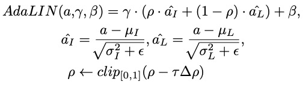

# GAN Applications

:shipit: :sparkles: :+1: :clap:
********

## Image-to-Image Translation

********
:strawberry:  [**Pix2Pix**](https://arxiv.org/pdf/1611.07004.pdf)   :date:   2016.11v1

********
:strawberry:  [**Pix2PixHD**](https://arxiv.org/pdf/1711.11585.pdf)   :date:   2017.11v1

High-Resolution Image Synthesis and Semantic Manipulation with Conditional GANs

#### Reference 

-    [Pix2PixHD - NVidia Official PyTorch](https://github.com/NVIDIA/pix2pixHD)

********
:strawberry:  [**MUNIT**](https://arxiv.org/pdf/1804.04732.pdf)   :date:   2018.04v1

MUNIT: Multimodal UNsupervised Image-to-image Translation

#### Reference 

-    [MUNIT - NVidia Official PyTorch](https://github.com/NVlabs/MUNIT)

-  [MUNIT - Keras](https://github.com/shaoanlu/MUNIT-keras)

-  [MUNIT - tensorflow1.4](https://github.com/taki0112/MUNIT-Tensorflow)

-  

********

:strawberry:  [**U-GAN-IT**](https://arxiv.org/pdf/1907.10830.pdf)   :date:   2019.07v1

#### Loss Function 

   - Adaptive Layer-Instance Normalization (AdaLIN)

      Combine the advantages of AdaIN and LN by selectively keeping or changing the content information
      选择或改变特定内容信息,融合了AdaIN和LN的优势

        

- [1982 - The Fréchet Distance between Multivariate Normal Distributions](https://core.ac.uk/download/pdf/82269844.pdf)

   Proof FID calculate Distributions
    
    

- [2017-(J)- Learning from uncertain curves: The 2-Wasserstein metric for Gaussian processes](https://papers.nips.cc/paper/7149-learning-from-uncertain-curves-the-2-wasserstein-metric-for-gaussian-processes.pdf)

#### Network 

    

#### Implementation 

-   [FID PyTorch](https://github.com/mseitzer/pytorch-fid)

      计算均值的时候是否包含零填充, PyTorch默认 count_include_pad=True, 这里计算FID要设置为False

      """
      Build pretrained Inception model for FID computation
      The Inception model for FID computation uses a different set of weights
      and has a slightly different structure than torchvision's Inception.
      This method first constructs torchvision's Inception and then patches the
      necessary parts that are different in the FID Inception model.
      """
      inception = _inception_v3(num_classes=1008, aux_logits=False, pretrained=False)
      inception.Mixed_5b = FIDInceptionA(192, pool_features=32)
      inception.Mixed_5c = FIDInceptionA(256, pool_features=64)
      inception.Mixed_5d = FIDInceptionA(288, pool_features=64)
      inception.Mixed_6b = FIDInceptionC(768, channels_7x7=128)
      inception.Mixed_6c = FIDInceptionC(768, channels_7x7=160)
      inception.Mixed_6d = FIDInceptionC(768, channels_7x7=160)
      inception.Mixed_6e = FIDInceptionC(768, channels_7x7=192)
      inception.Mixed_7b = FIDInceptionE_1(1280)
      inception.Mixed_7c = FIDInceptionE_2(2048)

- 

- 

-    

********

:strawberry:  [**UNIT (Unsupervised Image-to-Image Translation Networks)**](https://arxiv.org/pdf/1703.00848.pdf)   :date:   2017.03v1

#### Paper

- [2017 - Towards Principled Methods for Training Generative Adversarial Networks](https://arxiv.org/pdf/1701.04862.pdf)

      The FID metric calculates the distance between two distributions of images.
      Typically, we have summary statistics (mean & covariance matrix) of one of these distributions, 
      while the 2nd distribution is given by a GAN.

      FID between two multivariate Gaussians:
      X_1 ~ N(m, C) 
      X_2 ~ N(mw, Cw)

     

      FID computing, propagate images through the pretrained Inception-v3 model, 
      using the last pooling layers to calculate the mean mw and the covariance matrix Cw.

- [2017 - Wasserstein GAN](https://arxiv.org/pdf/1701.07875.pdf)

   Proof FID calculate Distributions
    
    

- [2017 - Improved Training of Wasserstein GANs](https://arxiv.org/pdf/1704.00028.pdf)

- [2017 - 【Blog】 - Wasserstein GAN and the Kantorovich-Rubinstein Duality](https://vincentherrmann.github.io/blog/wasserstein/) 

      

- [2019 - 【Blog】 - 从Wasserstein距离、对偶理论到WGAN](https://spaces.ac.cn/archives/6280)

#### Network 

    

#### Implementation 

-   [FID PyTorch](https://github.com/mseitzer/pytorch-fid)

      计算均值的时候是否包含零填充, PyTorch默认 count_include_pad=True, 这里计算FID要设置为False

      """
      Build pretrained Inception model for FID computation
      The Inception model for FID computation uses a different set of weights
      and has a slightly different structure than torchvision's Inception.
      This method first constructs torchvision's Inception and then patches the
      necessary parts that are different in the FID Inception model.
      """
      inception = _inception_v3(num_classes=1008, aux_logits=False, pretrained=False)
      inception.Mixed_5b = FIDInceptionA(192, pool_features=32)
      inception.Mixed_5c = FIDInceptionA(256, pool_features=64)
      inception.Mixed_5d = FIDInceptionA(288, pool_features=64)
      inception.Mixed_6b = FIDInceptionC(768, channels_7x7=128)
      inception.Mixed_6c = FIDInceptionC(768, channels_7x7=160)
      inception.Mixed_6d = FIDInceptionC(768, channels_7x7=160)
      inception.Mixed_6e = FIDInceptionC(768, channels_7x7=192)
      inception.Mixed_7b = FIDInceptionE_1(1280)
      inception.Mixed_7c = FIDInceptionE_2(2048)

- 

- 

-    

********

#### Reference 

- [FID TensorFlow 1.x Official](https://github.com/bioinf-jku/TTUR)

********
