# GAN Applications

********

## Image-to-Image Translation

********
:strawberry:  [**Pix2Pix**](https://arxiv.org/pdf/1611.07004.pdf)   :date:   2016.11v1    :blush:  UC Berkeley

Image-to-Image Translation with Conditional Adversarial Networks

改进：图像到图像的风格转移： 无需手工处理映射函数，损失函数

思路：cGAN + L1 Loss, U-Net;  PatchGAN Discriminator on NxN image patch

   ------
      Conditional GANs suitable for image-to-image translation tasks, 

      condition on an input image and generate a corresponding output image

      cGAN比较适合图像到图像的风格转移: 给输入图像施加条件, 生成对应的输出图像

   ------
      Generator: use a “U-Net”-based architecture; add skip connections

      For image translation, there is a great deal of low-level information shared between the input and output

      and it would be desirable to shuttle this information directly across the net

      Discriminator: use CNN “PatchGAN” classifier, which only penalizes structure at the scale of image patches

      Both generator and discriminator use modules of the form convolution-BatchNorm-ReLu

      生成器使用 类U-Net 架构; 添加跳层连接, 而不仅仅是使用自动编解码器

      图像转移, 希望输入和输出共享低阶信息, 直接把这些信息透传到网络中, 例如边缘信息

      判别器使用 Markovian discriminator 马尔科夫判别器/PatchGAN分类器, 只约束图像 NxN区块结构

      N远小于图像尺寸时, 生成的图像质量较高

      生成器和判别器都是用convolution-BatchNorm-ReLu

   ------
   [It's beneficial to mix the GAN objective with a more traditional loss, such as L2 distance](https://arxiv.org/pdf/1604.07379.pdf)

      discriminator’s job remains unchanged, 

      generator is tasked to not only fool the discriminator but also to be near the ground truth output in an L2 sense

      Using L1 distance rather than L2 as L1 encourages less blurring

      生成器不仅仅是要与判别器博弈, 还需要更可能地接近 训练样本;

      相比L2, 使用L1距离可以使图片更清晰

#### Loss Function

   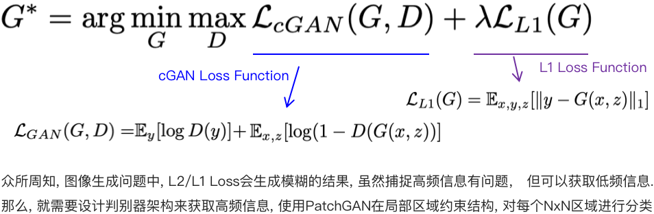

   λ = 0  , only cGAN gives much sharper results but introduces visual artifacts

   λ = 100, both terms together reduces these artifacts

#### Implementation 

-   [Pix2Pix + BEGAN PyTorch](https://github.com/taey16/pix2pixBEGAN.pytorch)

-  [Pix2Pix Keras](https://github.com/tdeboissiere/DeepLearningImplementations/tree/master/pix2pix)

#### Reference

- [Pix2Pix Project Homepage](https://phillipi.github.io/pix2pix/)

- [A Gentle Introduction to Pix2Pix Generative Adversarial Network](https://machinelearningmastery.com/a-gentle-introduction-to-pix2pix-generative-adversarial-network/)

- [How to Develop a Pix2Pix GAN for Image-to-Image Translation](https://machinelearningmastery.com/how-to-develop-a-pix2pix-gan-for-image-to-image-translation/)

- [New York Google Map dataset for Experiment](http://efrosgans.eecs.berkeley.edu/pix2pix/datasets/maps.tar.gz)

- [PatchGAN 感知域的理解](https://www.cnblogs.com/ChenKe-cheng/p/11207998.html)

********

:strawberry:  [**Pix2PixHD**](https://arxiv.org/pdf/1711.11585.pdf)   :date:   2017.11v1    :blush:  NVidia / UC Berkeley 

High-Resolution Image Synthesis and Semantic Manipulation with Conditional GANs

改进: 生成器分解为2个子2网络: 全局生成器 和 局部增强生成器; 判别器由粗到细, 多尺度架构

#### Reference 

-    [Pix2PixHD - NVidia Official PyTorch](https://github.com/NVIDIA/pix2pixHD)

********
:strawberry:  [**CycleGAN**](https://arxiv.org/pdf/1703.10593.pdf)   :date:   2017.03v1    :blush:  UC Berkeley 

Unpaired Image-to-Image Translation using Cycle-Consistent Adversarial Networks

#### Reference 

- [CycleGAN Offical](https://github.com/junyanz/CycleGAN)

- [How to Develop a CycleGAN for Image-to-Image Translation with Keras](https://machinelearningmastery.com/cyclegan-tutorial-with-keras/)

********

:strawberry:  [**UNIT**](https://arxiv.org/pdf/1703.00848.pdf)   :date:   2017.03v1    :blush:  Cornell University / NVidia

Unsupervised Image-to-Image Translation Networks

#### Network 

   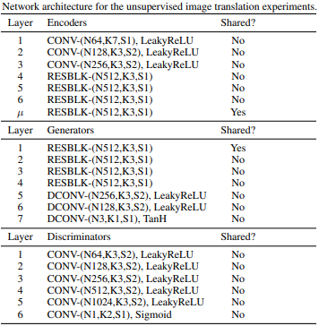 

#### Implementation 

-  

- 

-  [CycleGAN-TensorFlow](https://github.com/vanhuyz/CycleGAN-TensorFlow)

-    

#### Reference 

- [Understanding and Implementing CycleGAN in TensorFlow](https://hardikbansal.github.io/CycleGANBlog/)

********

:strawberry:  [**BicycleGAN**](https://arxiv.org/pdf/1711.11586.pdf)   :date:   2017.11v1    :blush:  UC Berkeley / Adobe Research

Toward Multimodal Image-to-Image Translation

#### Network 

   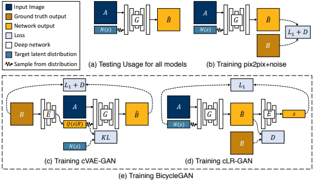 

#### Implementation 

-   [BicycleGAN Official PyTorch](https://github.com/junyanz/BicycleGAN)

- 

- 

-    

#### Reference 

********
:strawberry:  [**MUNIT**](https://arxiv.org/pdf/1804.04732.pdf)   :date:   2018.04v1    :blush:  Cornell University / NVidia

MUNIT: Multimodal UNsupervised Image-to-image Translation

#### Network 

   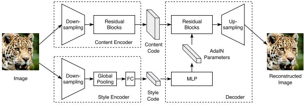 

#### Reference 

-    [MUNIT - NVidia Official PyTorch](https://github.com/NVlabs/MUNIT)

-  [MUNIT - Keras](https://github.com/shaoanlu/MUNIT-keras)

-  [MUNIT - tensorflow1.4](https://github.com/taki0112/MUNIT-Tensorflow)

-  

********

:strawberry:  [**StarGAN v1**](https://arxiv.org/pdf/1711.09020.pdf)   :date:   2017.11.24v1    :blush:  Korea University / Clova AI Research

StarGAN: Unified Generative Adversarial Networks for Multi-Domain Image-to-Image Translation

#### Network 

   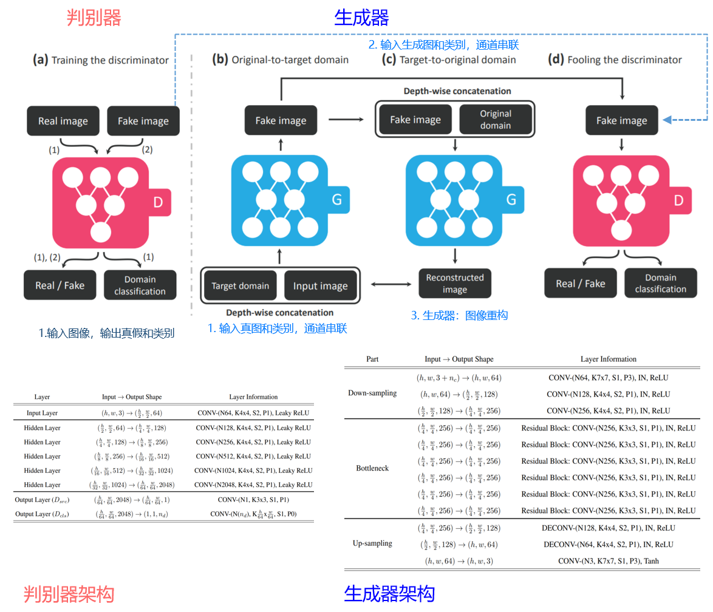 

   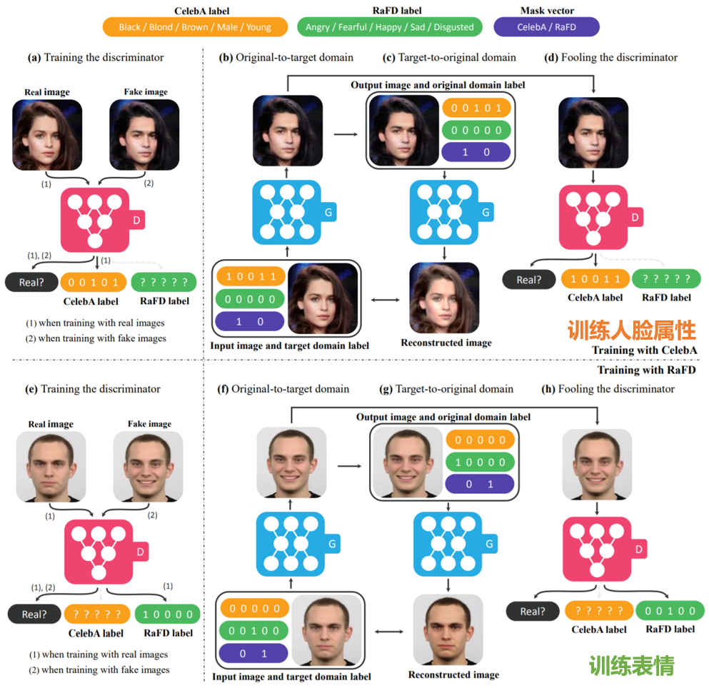 

#### Reference 

-    [StarGAN v1 Official PyTorch](https://github.com/yunjey/stargan)

-  [StarGAN v1 - Keras](https://github.com/hoangthang1607/StarGAN-Keras)

-  [StarGAN v1 - tensorflow1.8](https://github.com/taki0112/StarGAN-Tensorflow)

-  

********

:strawberry:  [**StarGAN v2**](https://arxiv.org/pdf/1912.01865.pdf)   :date:   2019.12.04v1    :blush:  Clova AI Research

StarGAN v2: Diverse Image Synthesis for Multiple Domains

#### Network 

    

    

#### Reference 

-    [StarGAN v2 Official PyTorch](https://github.com/clovaai/stargan-v2)

-  

-  

-  [StarGAN v2 - tensorflow2.1](https://github.com/clovaai/stargan-v2-tensorflow)

********

:strawberry:  [**GauGAN**](https://arxiv.org/pdf/1903.07291.pdf)   :date:   2019.03.18v1    :blush:  NVidia / UC Berkeley 

Semantic Image Synthesis with Spatially-Adaptive Normalization

#### Network 

   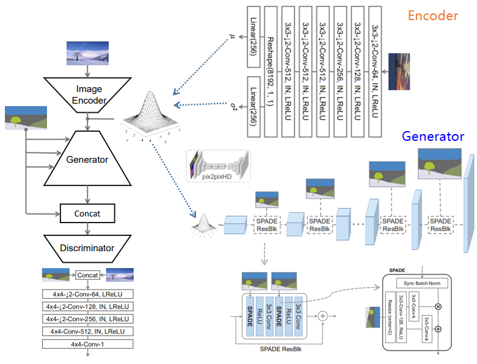 

#### Reference 

-    [SPADE Official PyTorch](https://github.com/NVlabs/SPADE)

********

:strawberry:  [**U-GAN-IT**](https://arxiv.org/pdf/1907.10830.pdf)   :date:   2019.07v1

#### Loss Function 

   - Adaptive Layer-Instance Normalization (AdaLIN)

      Combine the advantages of AdaIN and LN by selectively keeping or changing the content information
      
      选择或改变特定内容信息,融合了AdaIN和LN的优势

#### Network 

   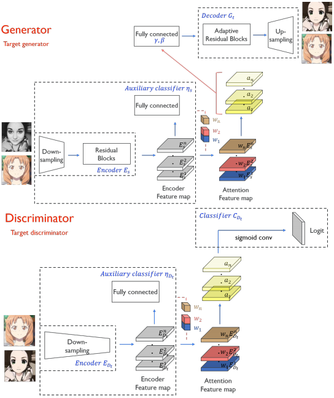 

#### Implementation 

-   [FID PyTorch](https://github.com/mseitzer/pytorch-fid)

- 

- 

-    

********

:strawberry:  [**FUNIT**](https://arxiv.org/pdf/1905.01723.pdf)   :date:   2019.05v1

Few-Shot Unsupervised Image-to-Image Translation

#### Network 

    

********

:strawberry:  [**StyleGAN Encoder for Image-to-Image Translation**](https://arxiv.org/pdf/2008.00951.pdf)   :date:   2020.08.03v1  :blush:  Penta-AI / Tel-Aviv University

Encoding in Style: a StyleGAN Encoder for Image-to-Image Translation

#### Network 

   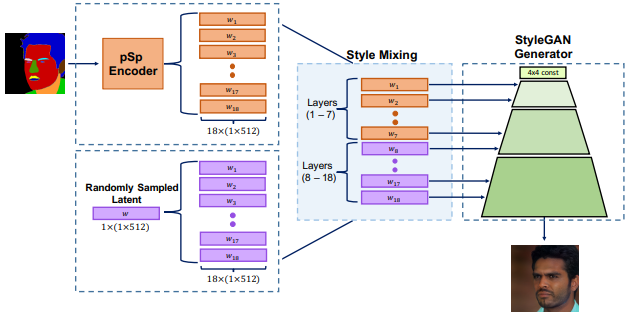 

********

:strawberry:  [**Improved StyleGAN Embedding: Where are the Good Latents?**](https://arxiv.org/pdf/2012.09036v1.pdf)   :date:   2020.12.13v1  :blush:  KAUST / Cardiff University

Improved StyleGAN Embedding: Where are the Good Latents?

#### Network 

    

********

:strawberry:  [**MPG**](https://arxiv.org/pdf/2012.02821v1.pdf)   :date:   2020.12.04v1  :blush:  Rutgers University / Samsung

MPG: A Multi-ingredient Pizza Image Generator with Conditional StyleGANs

#### Network 

    

********

## Face Synthesis

********

:tomato: [**FaceGAN**](https://arxiv.org/pdf/2011.04439.pdf)   :date:   2020.11.09v1    :blush:  Tampere University

FACEGAN： Facial Attribute Controllable rEenactment GAN

#### Network 

#### Implementation 

-   [flownet2-pytorch](https://github.com/NVIDIA/flownet2-pytorch)

********

:tomato: [**Designing an Encoder for StyleGAN Image Manipulation**](https://arxiv.org/pdf/2102.02766.pdf)   :date:   2021.02.04v1    :blush:  Tel-Aviv University

Designing an Encoder for StyleGAN Image Manipulation

#### Network 

https://www.paperswithcode.com/method/stylegan

https://mp.weixin.qq.com/s/BnxtjC2mUN5S9RlSrvdPZQ

#### Implementation 

-   [flownet2-pytorch](https://github.com/NVIDIA/flownet2-pytorch)

********

## Video Synthesis

********

:tomato: [**FlowNet 2.0**](https://arxiv.org/pdf/1612.01925.pdf)   :date:   2016.12.06v1    :blush:  NVidia

FlowNet 2.0: Evolution of Optical Flow Estimation with Deep Networks

#### Implementation 

-   [flownet2-pytorch](https://github.com/NVIDIA/flownet2-pytorch)

********

:tomato: [**RAFT**](https://arxiv.org/pdf/2003.12039.pdf)   :date:   2020.03.26v1    :blush:  Princeton University

RAFT: Recurrent All-Pairs Field Transforms for Optical Flow

#### Implementation 

-   [RAFT-pytorch](https://github.com/princeton-vl/RAFT)

********

:tomato: [**Video-to-Video Synthesis**](https://arxiv.org/pdf/1808.06601.pdf)   :date:   2018.08.20v1    :blush:  NVidia

Video-to-Video Synthesis

#### Implementation 

-   [Vid2Vid Pytorch](https://github.com/NVIDIA/vid2vid)

********

:tomato: [**Few-shot Video-to-Video Synthesis**](https://arxiv.org/pdf/1910.12713.pdf)   :date:   2019.10.28v1    :blush:  NVidia

Few-shot Video-to-Video Synthesis: compose a video based on a small number of reference images and a semantic images based on vid2vid

Video-to-video synthesis (vid2vid): converting an input semantic video to an output photorealistic video.

Conditional GAN framework, user input data not sampling from noise distribution

Vid2vid is based on Image-to-image synthesis, and keeps frames temporally consistent as a whole

Adaptive Network: part of weights are dynamically computed based on input data 

#### Network

flow prediction network W : reuse vid2vid
soft occlusion map prediction network M : reuse vid2vid
intermediate image synthesis network H : conditional image generator, adopt SPADE generator for semantic image synthesis

#### Implementation 

-   [Few-Shot-Vid2Vid Pytorch](https://github.com/NVlabs/few-shot-vid2vid)

********

:tomato: [**Face2Face**](https://zollhoefer.com/papers/CACM19_F2F/paper.pdf)   :date:   2016.03.23v1    :blush: Max-Planck-Institute for Informatics / TUM

Face2Face: Real-time Face Capture and Reenactment of RGB Videos

#### Implementation 

-   

- 

-  [face2face-demo](https://github.com/datitran/face2face-demo)

-    

#### Reference

- [Face2Face](http://niessnerlab.org/papers/2016/1facetoface/thies2016face.pdf)

- [Face2Face Supplemental Material](http://niessnerlab.org/papers/2016/1facetoface/thies2016face_supplemental.pdf)

********

:tomato: [**Neural Talking Head**](https://arxiv.org/pdf/1905.08233.pdf)   :date:   2019.05.20v1    :blush:  Samsung AI Center, Moscow / Skolkovo Institute of Science and Technology

Few-Shot Adversarial Learning of Realistic Neural Talking Head Models

#### Network

   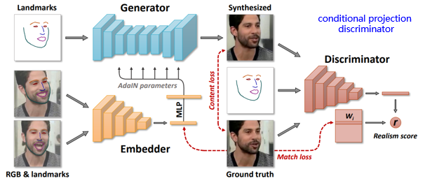

#### Implementation

-  [vincent-thevenin / Neural Talking Head](https://github.com/vincent-thevenin/Realistic-Neural-Talking-Head-Models)

********

:tomato: [**MarioNETte**](https://arxiv.org/pdf/1911.08139.pdf)   :date:   2019.11.19v1    :blush:  Hyperconnect Korea

MarioNETte: Few-shot Face Reenactment Preserving Identity of Unseen Targets

#### Network

   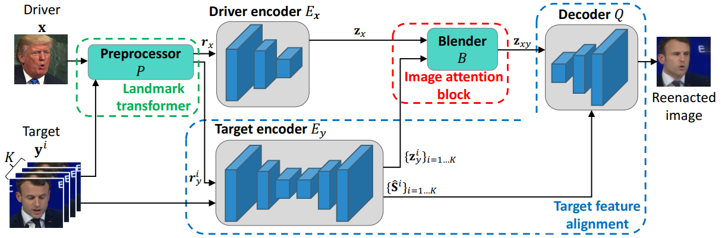

********
:tomato: [**First Order Motion Model**](https://arxiv.org/pdf/2003.00196.pdf)   :date:   2020.02.29v1    :blush:  University of Trento

First Order Motion Model for Image Animation

#### Network

- 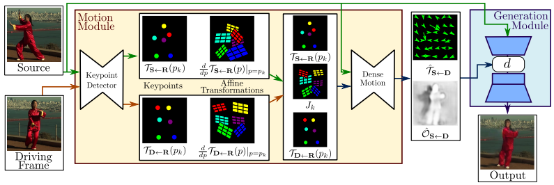

********
:tomato: [**One-Shot Free-View Neural Talking-Head Synthesis**](https://arxiv.org/pdf/2011.15126.pdf)   :date:   2020.11.30v1    :blush:  NVidia

One-Shot Free-View Neural Talking-Head Synthesis for Video Conferencing

单样本多角度人脸视频合成

- 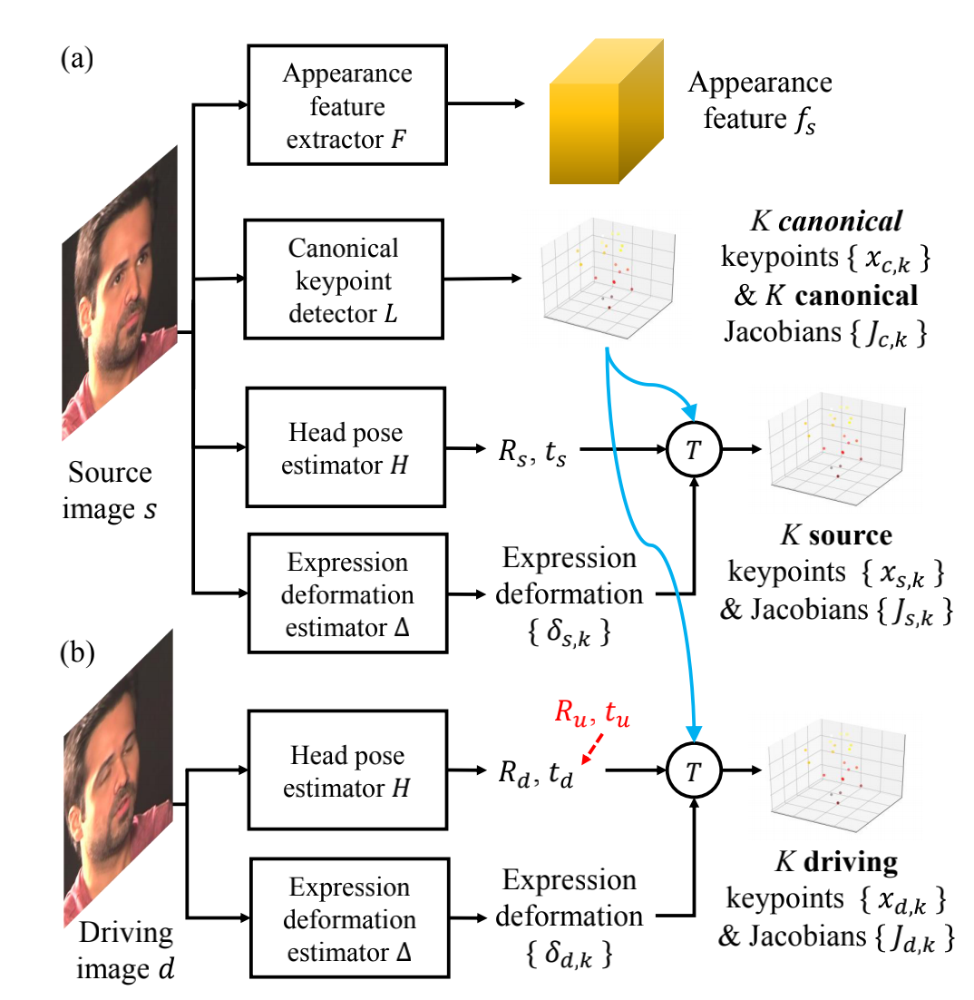

- 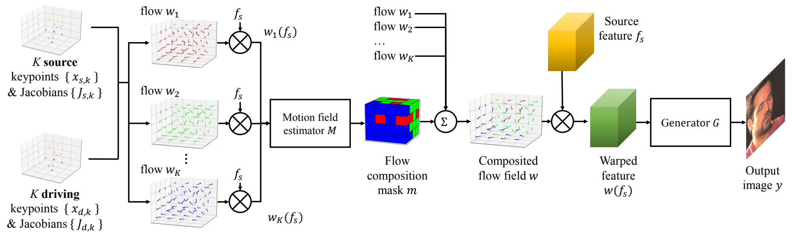

项目地址: https://nvlabs.github.io/face-vid2vid/

主流程: 

      1. 源图像特征提取:用3D特征提取网络(3D特征点检测网络)获取源图像的3D特征(20个3D关键点,宽、高和深度; 
      
      也用于后续视频合成的头部旋转和平移)和雅可比矩阵(关键点局部仿射变换到合成帧中,主要是表情的几何处理); 
      
      然后, 对于驱动视频, 用头部位姿估计网络获取旋转矩阵和平移向量, 还用表情形变估计网络估计3D形变(从中性表情的), 
      
      这两个网络都是从源图像提取运动几何信息。
      
      将前面关键点提取和这两个网络提取的几何信息结合, 即3D关键点经过旋转、平移、几何形变得到新的3D关键点, 
      雅可比矩阵经过旋转得到新的雅可比矩阵。

      2. 驱动视频特征提取: 对于驱动视频使用上述方法计算逐帧新的3D关键点和雅可比矩阵。

      3. 视频生成: 图像帧生成器, 输入处理好的特征, 生成新图像帧。
      
      输入特征的处理: 先用一阶估计计算20个关键点的光流, 然后用运动场估计网络估计光流掩码, 生成最终的特征用于生成。

      主要部分是3D关键点学习与分解
      (人脸表情的模型, 人头的几何表示; 两者结合生成特定图像的关键点; 再用关键点学习两个图像之间的映射关系; 
      这些步骤用一组网络实现, 联合训练)。

#### Network

- 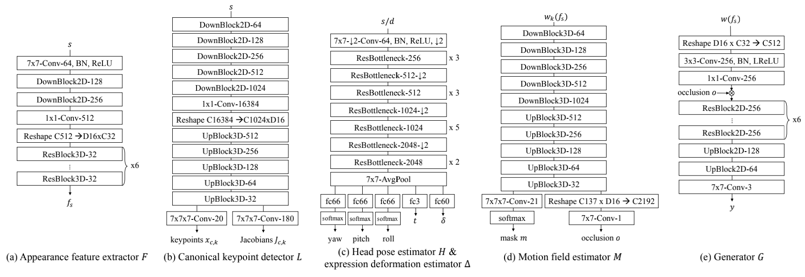

#### Loss Function

      一共用了6个网络: 3D特征提取器F, 3D规范化关键点提取器L, 位姿估计H, 表情形变估计网络△, 运动场估计网络M, 生成器G。

      6个损失函数: 
         感知损失Lp, 
         GAN损失LG, 
         关键点和雅克比等效损失LE(估计的关键点和变换回图像的L1距离), 
         关键点先验损失LL(平均深度阈值设置), 
         位姿估计LH(估计的位姿和预训练估计器生成位姿的L1距离), 
         形变先验损失L△(L1范数):

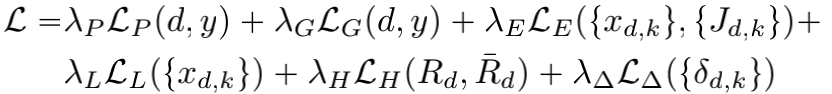

*******
:tomato: [**COCO-FUNIT: Few-Shot Unsupervised Image Translation with a Content Conditioned Style Encoder**](https://arxiv.org/pdf/2007.07431.pdf)    :date:   2020.07.15v1    :blush:  NVidia

********
:tomato: [**NaviGAN**](https://arxiv.org/pdf/2011.13786.pdf)   :date:   2020.11.27v1    :blush:  Yandex

Navigating the GAN Parameter Space for Semantic Image Editing

#### Network

- 

#### Implementation

-  [NaviGAN](https://github.com/yandex-research/navigan)

