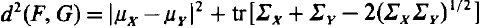

# GAN_Understand

:shipit: :sparkles: :+1: :clap:

********

:watermelon:  **Fréchet Inception Distance (FID score)**   :date:   2017

#### Paper

- [2017 - GANs Trained by a Two Time-Scale Update Rule Converge to a Local Nash Equilibrium](https://arxiv.org/pdf/1706.08500)

      The FID metric calculates the distance between two distributions of images.
      Typically, we have summary statistics (mean & covariance matrix) of one of these distributions, 
      while the 2nd distribution is given by a GAN.

     

- [1982 - The Fréchet Distance between Multivariate Normal Distributions](https://core.ac.uk/download/pdf/82269844.pdf)

   Proof FID calculate Distributions 
    

#### Network 

#### Implementation 
<!-- -   [DCGAN tensorflow Official](https://github.com/tensorflow/docs-l10n/blob/master/site/zh-cn/tutorials/generative/dcgan.ipynb) -->

-   

- 

- 

-    

#### Reference 

- [FID TensorFlow 1.x Official](https://github.com/bioinf-jku/TTUR)
- [FID PyTorch](https://github.com/mseitzer/pytorch-fid)

********

:lemon:  **ConditionalGAN**   :date:    2014

#### Network 

#### Implementation 

- 

- 

- 

-    

********

:lemon:  **WassersteinGAN**   :date:    2017

#### Implementation 

- 

- 

- 

-    

********

:lemon:  **InfoGAN**   :date:    2016

#### Implementation 

- 

- 

- 

-    

********

## Dataset

- [Kaggle - CelebA: 200k images with 40 binary attribute](https://www.kaggle.com/jessicali9530/celeba-dataset/data#)

********

## Reference

- [2019 - Generative Adversarial Networks in Computer Vision: A Survey and Taxonomy](https://arxiv.org/pdf/1906.01529.pdf)

- [Generative model](https://en.wikipedia.org/wiki/Generative_model)

- [Lecture 13: Generative Models](http://cs231n.stanford.edu/slides/2017/cs231n_2017_lecture13.pdf)

- [Ian Goodfellow GANs PPT @ NIPS 2016](http://www.iangoodfellow.com/slides/2016-12-04-NIPS.pdf)
