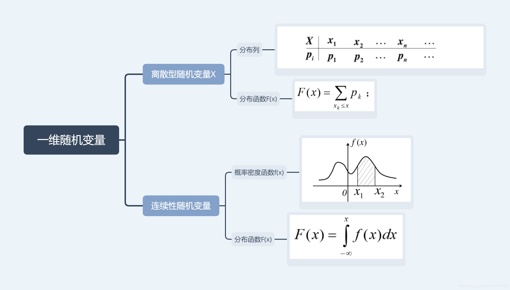
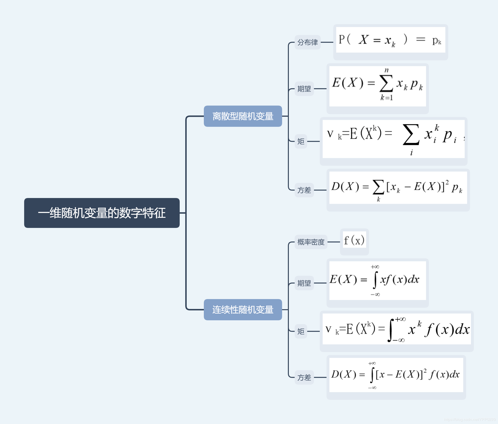
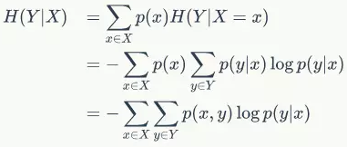
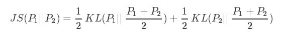

# GAN Mathmatics

********

[概率论](#probability-theory-概率论)

[统计方法](#statistical-method-统计方法)

[信息论](#information-theory-信息论)

********

:peach:  [**Kullback-Leibler Divergence**](https://en.wikipedia.org/wiki/Kullback%E2%80%93Leibler_divergence) 

:peach:  [**Jensen–Shannon Divergence**](https://en.wikipedia.org/wiki/Jensen%E2%80%93Shannon_divergence) 

:peach:  [**Wasserstein Distance**](https://en.wikipedia.org/wiki/Wasserstein_metric) 

********

## Probability Theory and Information Theory

**提出问题: 为什么?**

        机器学习通常必须处理不确定量，有时也可能需要处理随机 (非确定性的) 量。

        我们的确需要一种用以对不确定性进行表示和推理的方法, 使用概率论来量化不确定性; 事件发生的概率相等/不等

********
:peach:  [**Probability Theory  概率论**](https://github.com/jcnlp/books/blob/master/math/%E6%A6%82%E7%8E%87%E8%AE%BA%E4%B8%8E%E6%95%B0%E7%90%86%E7%BB%9F%E8%AE%A1(%E6%B5%99%E5%A4%A7%E7%AC%AC%E5%9B%9B%E7%89%88).pdf)

#### Probability Theory  概率论

**概率论的作用与定义:**

        概率论本质上是对随机事件的发生可能性赋以一种合理的度量。

        将“事件”这个概念抽象化, 引入“集合论”, 把这些事件表示成集合。

        接着对事件的发生进行度量, 就赋予相应的概率测度。

        样本空间(sample space): 所有可能的结果构成的集合

        概率P(E)是发生频率的极限:  

        随机变量(Random Variable): 从样本空间到实数的函数; 
        
        一个可能随机取不同值的变量。例如:抛掷一枚硬币，出现正面或者反面的结果;
        
        对可能状态的描述, 伴随概率分布来指定每个状态的可能性; 可以是离散的或连续的.

        离散随机变量/概率空间: 随机变量即在一定区间内变量取值为有限个或可数个;
        
        离散型随机变量通常依据概率质量函数分类，主要分为：伯努利随机变量、二项随机变量、几何随机变量和泊松随机变量。

        连续随机变量/概率空间: 随机变量即在一定区间内变量取值有无限个，或数值无法一一列举出来。

        几个重要的连续随机变量常常出现在概率论中，如：均匀随机变量、指数随机变量、伽马随机变量和正态随机变量。

**概率空间上的基本运算:**

        离散变量概率分布用概率质量函数(Probability Mass Funcation: PMF)表示:

        概率质量函数将随机变量的每个取值映射到取到该值/状态的概率, 记为: x~P(x), 概率为1表示确定发生;为0表示不可能发生.

        多个变量的概率分布为: 联合概率分布(Joint Probability Distribution), 记为: P(x,y) 或 P(x=x, y=y)

        PMF的性质:

        1. 定义域是所有可能状态的集合
        2. 概率取值的值域是[0, 1]
        3. 归一化(Normalized): 概率取值的和为1

        x有k个状态的 均匀分布: P(x=xi) = 1/k (i取k); 和 = 1

        ********

        连续变量概率分布用概率密度函数(Probability Density Function: PDF)表示:

        PDF的性质:

        1. 定义域是所有可能状态的集合
        2. 概率取值>=0; 并不要求p(x)<=1
        3. 归一化(Normalized): 概率积分取值为1, 对概率密度函数在较小的区间上求积分来获得概率质量
    
        均匀分布: u(x:a,b) = 1 / (b-a), 表示x取值范围为[a,b],积分为1; 该范围外的取值为0, 记为x~U(a,b)

        ********

        联合概率指的是包含多个条件且所有条件同时成立的概率，记作P(X=a,Y=b)或P(a,b)

        边缘概率分布(Marginal Probability Distribution): 边缘概率是与联合概率对应，P(X=a)或P(Y=b)，仅与单个随机变量有关的概率称为边缘概率

        条件概率: 某事件在其他事件发生情况下出现的概率

        条件概率的链式法则:

        ********

        平均度, 偏离度, 相关性

        期望 Expectation: 加权求和; 概率积分

        方差 Variance: x相对期望/均值的偏离程度,分布情况; 标准差 Standard Deviation 是方差的平方根

        • 频率学派概率 (Frequentist Probability):认为概率和事件发生的频率相关。

        • 贝叶斯学派概率 (Bayesian Probability):认为概率是对某件事发生的确定程度，可以理解成是确信的程度。

        贝叶斯公式：

<!--  -->

#### Reference 

-  [概率论和数理统计公式总结](https://zhuanlan.zhihu.com/p/36584335)

-  [DL_code: distribution-is-all-you-need](https://github.com/graykode/distribution-is-all-you-need)

-  [联合概率、边缘概率、条件概率之间的关系&贝叶斯公式](https://blog.csdn.net/tick_tock97/article/details/79885868)

********
:peach: [**Statistical Method 统计方法**](https://en.wikibooks.org/wiki/Statistics/Introduction/What_is_Statistics)
#### Statistical Method 统计方法

        函数估计的所有模型都是基于最大似然估计:

        p(x, a)是密度函数的集合, p(x, a0)属于这个函数集合中的一个. 用独立同分布数据x1, ...xn, 来估计密度函数.

#### Reference 

- [从最大似然估计到交叉熵](https://www.cnblogs.com/LeftNotEasy/p/mle-cross-entropy-and-deep-learning.html)

********
:peach:  [**Information Theory  信息论**](https://arxiv.org/pdf/1711.11585.pdf) 

#### Information Theory  信息论

**信息量:** 

        一条信息的信息量与其不确定性有直接的关系.

        我们要搞清楚一件非常不确定的事情, 或一无所知的事情, 就需要了解大量信息。

        信息量就等于不确定性的多少。

**量化信息的度量:**

        32支球队, 冠军是谁? 需要五次, 每猜一次一块钱, 猜对就需要猜五次, 信息量就值五块钱.

        香农用"比特"Bit来度量信息量。 一个比特即是一位二进制, 一个字节8比特. 32只球队猜冠军,信息是5比特; 64只球队, 信息是6比特.

        信息量的比特数和所有可能情况的对数log有关: log32=5; log64=6.

        但当事件发生的概率不等时, 比如求"冠军"的信息量比5比特少.

        因此, 准确信息量应该是:  

**信息熵:**

        这个信息量, 香农定义为"信息熵"Entropy, 用符号H表示, 单位是比特; 

        这和热力学的熵有很大相似性, 是系统无序的度量, 换一个角度也是一种不确定性的度量.

        熵在信息论中代表随机变量不确定度的度量。

        一个离散型随机变量X的熵 H(X) 定义为:

        变量的不确定性越大,熵就越大,要把它确定, 所需的信息量就越大. 

        比如, 常用汉字约7000字, 假如每个汉字等概率, 那么大约13Bit表示一个汉字。

        但汉字的使用频率不均等, 大概10%的汉字占常用文本的95%以上, 如假设这些文字独立概率, 信息熵约8-9Bit, 考虑上下文相关性, 约5Bit.

        50万字的中文书, 信息量大约250万Bit, 整本书大约320K; 如果用2字节存储, 约1MB。

**条件熵**

        条件熵H（Y|X）表示在已知随机变量X的条件下随机变量Y的不确定性。

        随机变量X给定的条件下随机变量Y的条件熵H(Y|X):

        条件熵: 知道X后Y还剩多少信息量（H(Y|X)）。或者知道Y后，X还剩多少信息量（H(X|Y)）。

        信息的作用是用来消除不确定性.

**互信息 Mutual Information:**

        "互信息": 两个或多个随机事件"相关性"的量化度量.  

        两个事件相关性的量化度量, 在了解其中一个事件的前提下, 对消除另一个事件不确定性所提供的信息量.

        条件熵之间的差异.

<!--  -->

**相对熵 Relative Entropy:**

        相对熵衡量两个信息的相似程度,信息越相似相对熵就越小. 
        
        也用来衡量相关性, 但与变量的互信息不同, 衡量正函数的相似性.
        
        以提出者的名字命名, 也叫 KL散度（Kullback–Leibler divergence）, 用于衡量两个概率分布之间的差异。

        定义为:

        1. 即两个事件分布完全相同，那么KL散度等于0。
        2. 减号左边的就是事件A的熵
        3. KL散度来计算两个分布A与B的时候是不是对称的，有“坐标系”的问题; 换句话说，KL散度由A自己的熵与B在A上的期望共同决定。
            当使用KL散度来衡量两个事件(连续或离散)，上面的公式意义就是求 A与B之间的对数差 在 A上的期望值。 

        ********

**JS Divergence:**

        将KL Divergence不等式两边取平均, 基于KL散度的变体，解决了KL散度非对称的问题。

        一般地，JS散度是对称的，其取值是0到1之间。

#### Reference 

<!-- -   -->
-  [《数学之美》( The beauty of Mathematics)](https://github.com/mantchs/Mathematics)

- [UCB Data8 计算与推断思维 with Python Code](https://data8.apachecn.org/#/)

- [AI学习路线资料汇总](https://www.chainnews.com/articles/964633052193.htm)

- [深度学习_花书中文翻译与代码_Python_Numpy](https://github.com/MingchaoZhu/DeepLearning)

- [信息熵是什么？](https://www.zhihu.com/question/22178202)

- [什么是「互信息」？](https://www.zhihu.com/question/304499706/answer/544609335)
  
- [为什么交叉熵（cross-entropy）可以用于计算代价？](https://www.zhihu.com/question/65288314/answer/244557337)

- [如何通俗的解释交叉熵与相对熵？](https://www.zhihu.com/question/41252833)

- [Book: Information Theory, Inference, and Learning Algorithms _ English](http://www.inference.org.uk/itprnn/book.pdf)
  
- [David MacKay Homepage](http://www.inference.org.uk/mackay/itila/)

********