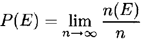

# GAN Mathmatics

********

:kiwi fruit:  [**Kullback-Leibler Divergence**](https://en.wikipedia.org/wiki/Kullback%E2%80%93Leibler_divergence) 

:kiwi fruit:  [**Jensen–Shannon Divergence**](https://en.wikipedia.org/wiki/Jensen%E2%80%93Shannon_divergence) 

:kiwi fruit:  [**Wasserstein Distance**](https://en.wikipedia.org/wiki/Wasserstein_metric) 

#### Reference 

-    [MUNIT - NVidia Official PyTorch](https://github.com/NVlabs/MUNIT)

********

## Probability Theory and Information Theory

********
:kiwi fruit:  [**Probability Theory  概率论**](https://arxiv.org/pdf/1611.07004.pdf)

概率论本质上是对随机事件的发生可能性赋以一种合理的度量。将“事件”这个概念抽象化, 引入“集合论”, 把这些事件表示成集合。接着对事件的发生进行度量, 就赋予相应的概率测度。

样本空间(sample space): 所有可能的结果构成的集合

概率P(E)是发生频率的极限:  

离散概率空间 

随机变量: 从样本空间到实数的函数

#### Reference 

-    [Pix2PixHD - NVidia Official PyTorch](https://github.com/NVIDIA/pix2pixHD)

********
:kiwi fruit:  [**Information Theory  信息论**](https://arxiv.org/pdf/1711.11585.pdf) 

#### Reference 

-    [MUNIT - NVidia Official PyTorch](https://github.com/NVlabs/MUNIT)

********