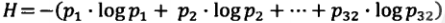

# GAN Mathmatics

********

:peach:  [**Kullback-Leibler Divergence**](https://en.wikipedia.org/wiki/Kullback%E2%80%93Leibler_divergence) 

:peach:  [**Jensen–Shannon Divergence**](https://en.wikipedia.org/wiki/Jensen%E2%80%93Shannon_divergence) 

:peach:  [**Wasserstein Distance**](https://en.wikipedia.org/wiki/Wasserstein_metric) 

#### Reference 

-    [MUNIT - NVidia Official PyTorch](https://github.com/NVlabs/MUNIT)

********

## Probability Theory and Information Theory

********
:peach:  [**Probability Theory  概率论**](https://arxiv.org/pdf/1611.07004.pdf)

概率论本质上是对随机事件的发生可能性赋以一种合理的度量。将“事件”这个概念抽象化, 引入“集合论”, 把这些事件表示成集合。接着对事件的发生进行度量, 就赋予相应的概率测度。

样本空间(sample space): 所有可能的结果构成的集合

概率P(E)是发生频率的极限:  

离散概率空间

随机变量: 从样本空间到实数的函数

#### Reference 

-    [Pix2PixHD - NVidia Official PyTorch](https://github.com/NVIDIA/pix2pixHD)

********
:peach:  [**Information Theory  信息论**](https://arxiv.org/pdf/1711.11585.pdf) 

**信息量:** 

    一条信息的信息量与其不确定性有直接的关系.

    我们要搞清楚一件非常不确定的事情, 或一无所知的事情, 就需要了解大量信息。

    信息量就等于不确定性的多少。

**量化信息的度量:**

    32支球队, 冠军是谁? 需要五次, 每猜一次一块钱, 猜对就需要猜五次, 信息量就值五块钱.

    香农用"比特"Bit来度量信息量。 一个比特即是一位二进制, 一个字节8比特. 32只球队猜冠军,信息是5比特; 64只球队, 信息是6比特.

    信息量的比特数和所有可能情况的对数log有关: log32=5; log64=6.

    但当事件发生的概率不等时, 比如求"冠军"的信息量比5比特少.

    因此, 准确信息量应该是: 

**信息熵:**

    这个信息量, 香农定义为"信息熵"Entropy, 用符号H表示, 单位是比特; 

    这和热力学的熵有很大相似性, 是系统无序的度量, 换一个角度也是一种不确定性的度量.

#### Reference 

<!-- -   -->
-  [《数学之美》( The beauty of Mathematics)](https://github.com/mantchs/Mathematics)

********