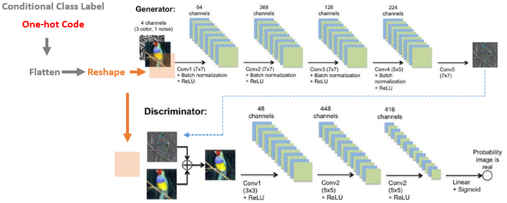
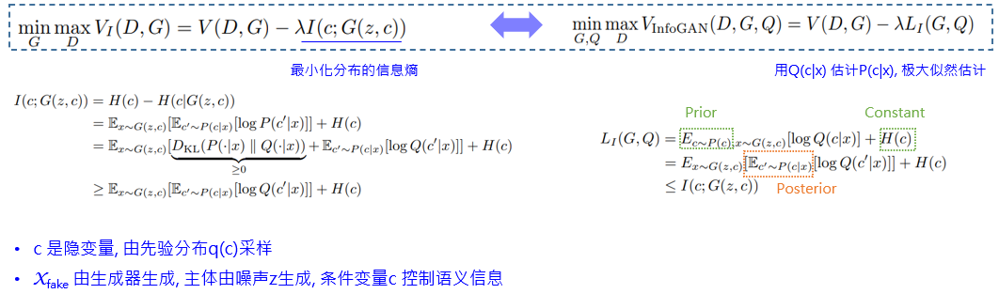
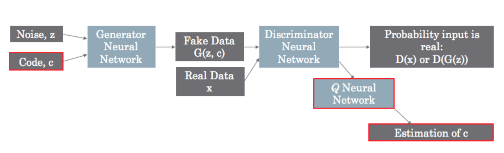
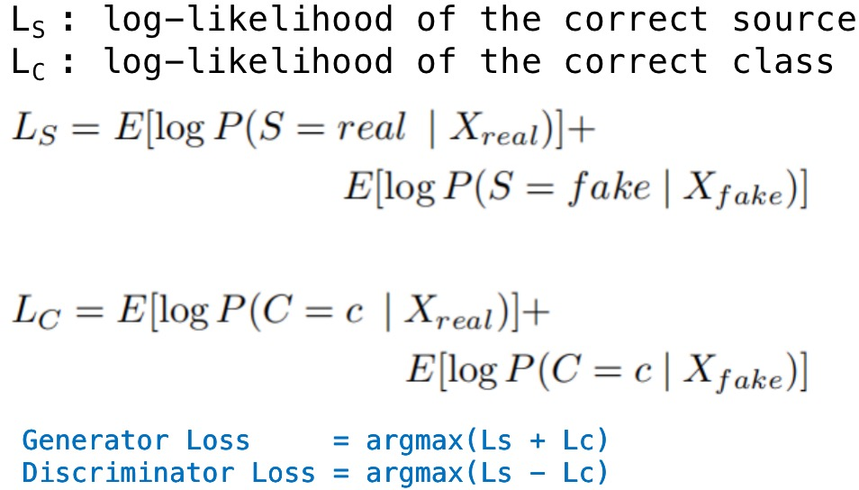
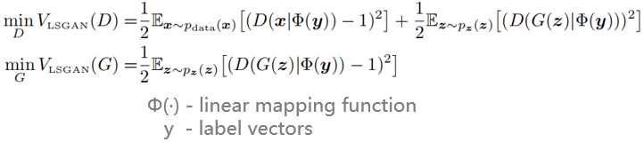
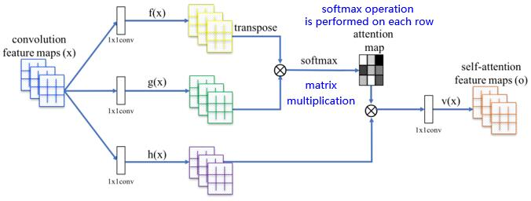
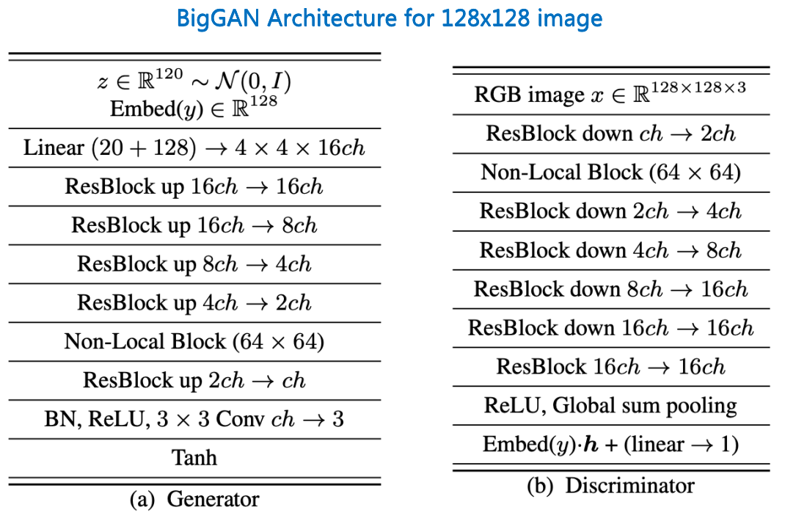
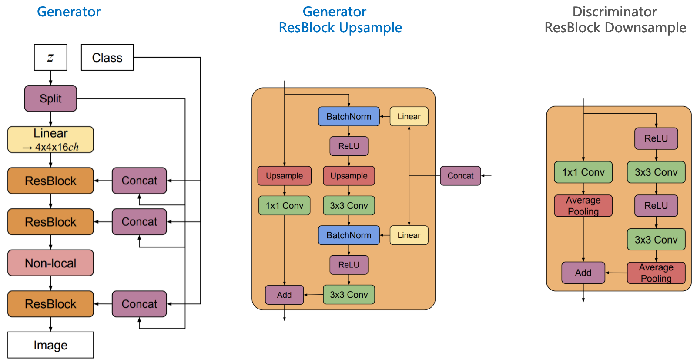
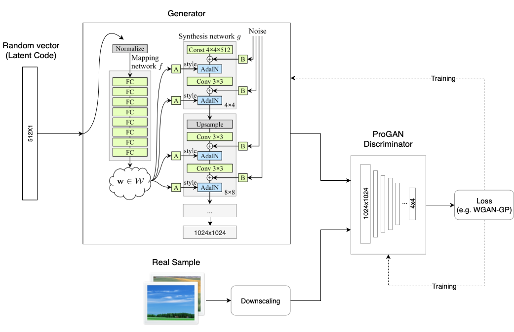

# GAN_Understanding_Practicing

## [GAN Understand](./GAN_Understanding/README.md)

********

## GAN Practice

:shipit: :sparkles: :+1: :clap:

[**GAN Evoluation**](https://arxiv.org/pdf/1910.13076.pdf)
   

********
### GAN Network Structure

********

:lemon:  [**GAN**](https://arxiv.org/pdf/1406.2661.pdf)   :date:   2014.06    :blush:  Université de Montréal

#### GAN Principle

   

#### Network


Discriminator
```
_________________________________________________________________
Layer (type)                 Output Shape              Param #
=================================================================
conv2d_1 (Conv2D)            (None, 14, 14, 128)       1280
_________________________________________________________________
leaky_re_lu_1 (LeakyReLU)    (None, 14, 14, 128)       0
_________________________________________________________________
conv2d_2 (Conv2D)            (None, 7, 7, 128)         147584
_________________________________________________________________
leaky_re_lu_2 (LeakyReLU)    (None, 7, 7, 128)         0
_________________________________________________________________
flatten_1 (Flatten)          (None, 6272)              0
_________________________________________________________________
dropout_1 (Dropout)          (None, 6272)              0
_________________________________________________________________
dense_1 (Dense)              (None, 1)                 6273
=================================================================
Total params: 155,137
Trainable params: 155,137
Non-trainable params: 0
_________________________________________________________________
```

Generator
```
_________________________________________________________________
Layer (type)                 Output Shape              Param #
=================================================================
dense_2 (Dense)              (None, 6272)              633472
_________________________________________________________________
leaky_re_lu_3 (LeakyReLU)    (None, 6272)              0
_________________________________________________________________
reshape_1 (Reshape)          (None, 7, 7, 128)         0
_________________________________________________________________
conv2d_transpose_1 (Conv2DTr (None, 14, 14, 128)       262272
_________________________________________________________________
leaky_re_lu_4 (LeakyReLU)    (None, 14, 14, 128)       0
_________________________________________________________________
conv2d_transpose_2 (Conv2DTr (None, 28, 28, 128)       262272
_________________________________________________________________
leaky_re_lu_5 (LeakyReLU)    (None, 28, 28, 128)       0
_________________________________________________________________
conv2d_3 (Conv2D)            (None, 28, 28, 1)         6273
=================================================================
Total params: 1,164,289
Trainable params: 1,164,289
Non-trainable params: 0
_________________________________________________________________
```

GAN
```
_________________________________________________________________
Layer (type)                 Output Shape              Param #
=================================================================
sequential_2 (Sequential)    (None, 28, 28, 1)         1164289
_________________________________________________________________
sequential_1 (Sequential)    (None, 1)                 155137
=================================================================
Total params: 1,319,426
Trainable params: 1,164,289
Non-trainable params: 155,137
_________________________________________________________________
```

#### GAN Loss


#### Implementation 

-  [GAN](https://github.com/taylorguo/GAN_Understanding_Practicing/blob/master/GAN_Practicing/Keras/gan_keras.py)

#### Reference 

- [GAN by Ian J. Goodfellow](https://github.com/goodfeli/adversarial)

********

:lemon:  [**DCGAN**](https://arxiv.org/pdf/1511.06434.pdf)   :date:   2015.11    :blush:  indico Research/Facebook

#### Loss Function 

- 【Binary_Cross_Entropy】    
  
   
    
- 【Loss Function】    

   


#### Network 

   

#### Implementation 

- 

-  [DCGAN Keras](https://github.com/taylorguo/GAN_Understanding_Practicing/blob/master/GAN_Practicing/Keras/dcgan_keras.py)

- 

-    


#### Reference 

- [DCGAN TensorFlow2.x Official](https://github.com/tensorflow/docs-l10n/blob/master/site/zh-cn/tutorials/generative/dcgan.ipynb)
- [DCGAN PyTorch](https://github.com/znxlwm/pytorch-MNIST-CelebA-GAN-DCGAN)

********

:lemon:  [**LAPGAN**](https://arxiv.org/pdf/1506.05751.pdf)   :date:   2015.06    :blush:  NYU, Facebook

Deep Generative Image Models using a Laplacian Pyramid of Adversarial Networks

Integrate conditional GAN model into Laplacian Pyramid Framework 

-  将cGAN集成到 Laplacian Pyramid Framework, generator和discriminator都是卷积网络
-  cGAN conditional 是类别信息, 类别的先验分布; 这里的conditional是另一个图像, 从cGAN模型生成的图像
-  Lapacian Pyramid 拉普拉斯高斯金字塔的每一层嵌入cGAN

#### Loss Function 
  
- 【Loss Function】    

   


#### Network 

   

   

#### Implementation 

- 

- 

- 

-    


#### Reference 

- [LAPGAN TensorFlow](https://github.com/jimfleming/LAPGAN)
- [LAPGAN PyTorch](https://github.com/AaronYALai/Generative_Adversarial_Networks_PyTorch/tree/master/LAPGAN)
- [LAPGAN Network Architecture - Offical](https://gist.github.com/soumith/e3f722173ea16c1ea0d9)
- [图像与滤波](http://www.ruanyifeng.com/blog/2017/12/image-and-wave-filters.html)

********


********

:lemon:  [**ConditionalGAN**](https://arxiv.org/pdf/1411.1784.pdf)   :date:    2014.11    :blush:    Université de Montréal/Flickr(Yahoo)

- Log-Likelihood Estimates 对数最大似然估计
- Conditioning the model to direct the data generation process possibly 模型增加条件控制控制数据生成过程; conditioning based on class labels 条件控制是数据类别标签
- Probabilistic one-to-many mapping is instantiated as a conditional predictive distribution, the input is taken to be conditioning variable 输入条件变量可以实现一对多的条件生成分布,从而生成样本

#### Loss Function
- 【Loss Function】    
  
   

#### Network 

#### Implementation 

- 

-  [cGAN Keras](https://github.com/taylorguo/GAN_Understanding_Practicing/blob/master/GAN_Practicing/Keras/cgan_keras.py)

- 

-    

#### Reference 

- [cGAN Keras: How to Develop a Conditional GAN (cGAN) From Scratch](https://machinelearningmastery.com/how-to-develop-a-conditional-generative-adversarial-network-from-scratch/)
- [cDCGAN Keras](https://github.com/gaborvecsei/CDCGAN-Keras)

********

:lemon:  [**InfoGAN**](https://arxiv.org/pdf/1606.03657.pdf)   :date:    2016.06    :blush:  UC Berkeley /  OpenAI

InfoGAN: Interpretable Representation Learning by
Information Maximizing Generative Adversarial Nets

#### Key insights

   A new term encourages high mutual information between generated samples and a small subset of latent variables c. 

   many domains naturally decompose into a set of semantically meaningful factors of variation

   decompose the input noise vector into two parts: 

   (i) z, which is treated as source of incompressible noise;

   (ii) c, which we will call the latent code and will target the salient structured semantic features of the data distribution.

   将输入噪声分为两部分: z噪声; c 隐代码控制数据分布的显著结构性语义特征

   InfoGAN approaches this problem is by splitting the Generator input into two parts: 

   the traditional noise vector and a new “latent code” vector. 

   The codes are then made meaningful by maximizing the Mutual Information between the code and the Generator output.

   最大化c隐代码和生成器的输出

   defining an auxiliary distribution Q(c|x) to approximate P(c|x):

   

   InfoGAN loss function for θ is this:

      ℓinfoGAN(θ) = I[x,y] − λI[xfake,c]
   


#### Network

   


#### Implementation 

- 

- 

-  [InfoGAN Official OpenAI](https://github.com/openai/InfoGAN)

-    


#### Reference

- [2017- Guiding InfoGAN with Semi-Supervision](https://ait.ethz.ch/projects/2017/ss-infogan/spurr2017ecml.pdf)

- [Correcting a proof in the InfoGAN paper](http://aoliver.org/assets/correct-proof-of-infogan-lemma.pdf)

- [Overview of GANs - Part III : InfoGAN](https://blog.zakjost.com/post/gans_overview_3/)

- [InfoGAN: using the variational bound on mutual information (twice)](https://www.inference.vc/infogan-variational-bound-on-mutual-information-twice/)

- [深度学习的互信息：无监督提取特征](https://kexue.fm/archives/6024)
  
- [李宏毅-InfoGAN, VAE-GAN, BiGAN 讲座](https://speech.ee.ntu.edu.tw/~tlkagk/courses_MLDS18.html)

- [【論文メモ：InfoGAN】](https://www.nogawanogawa.com/entry/infogan)
********

:lemon:  [**SGAN**](https://arxiv.org/pdf/1606.01583.pdf)   :date:    2016.06

Semi-Supervised Learning with Generative Adversarial Networks

#### Implementation 

- 

- 

- 

-    


********
:lemon:  [**ACGAN**](https://arxiv.org/pdf/1610.09585.pdf)   :date:   2016.10

#### Loss Function 
    
- 【Loss Function】    

   


#### Network 

   

#### Implementation 

- 

- 

- 

-    


#### Reference 

- [ACGAN Keras](https://github.com/lukedeo/keras-acgan)
- [ACGAN Keras Notebook](https://github.com/lukedeo/keras-acgan/blob/master/acgan-analysis.ipynb)
- [ACGAN PyTorch](https://github.com/clvrai/ACGAN-PyTorch)


********

:lemon:  [**LSGAN**](https://arxiv.org/pdf/1611.04076.pdf)   :date:   2016.11

#### Loss Function 
    
- 【Loss Function】    

   

#### Network 

   

#### Implementation 

- 

- 

- 

-    


********

:lemon:  [**EBGAN**: Energy-based GAN](https://arxiv.org/pdf/1609.03126.pdf)   :date:   2016.09    :blush:  NYU  


#### Loss Function 
    
- 【Loss Function】    

   


#### Network 

   

#### Implementation 

- 

- 

- 

-    


********

:lemon:  [**WassersteinGAN**](https://arxiv.org/pdf/1701.07875.pdf)   :date:    2017.01

#### Implementation 

- 

- 

- 

-    

********

:lemon:  [**WGAN-GP**](https://arxiv.org/pdf/1704.00028.pdf)   :date:    2017.03

#### Implementation 

- 

- 

- 

-  

********
:lemon:  [**SN-GAN**](https://arxiv.org/pdf/1802.05751v3.pdf)   :date:    2018.02

   **Algorithm: SGD with Spectral Normalization**
      
         


   


#### Reference 

- [2017 - Spectral Norm Regularization for Improving the Generalizability of Deep Learning](https://arxiv.org/pdf/1705.10941.pdf)

- [2018 - 【Blog】 - Spectral Normalization Explained](https://christiancosgrove.com/blog/2018/01/04/spectral-normalization-explained.html)

********


:lemon:  [**Image Transformer**](https://arxiv.org/pdf/1802.05751v3.pdf)   :date:    2018.02


********

:lemon:  [**Self-Attention GAN**](https://arxiv.org/pdf/1805.08318.pdf)   :date:    2018.05

Self-Attention Generative Adversarial Networks


#### Network 

- Self-Attention Module: modeling long-range dependencies
- Spectral Normalization in Generator: stabilize GAN training
- TTUR: Speed-up training of regularized discriminator



#### Implementation 

- 

- 

- 

-    


#### Reference 

- [SAGAN TensorFlow1.8](https://github.com/taki0112/Self-Attention-GAN-Tensorflow)
- [SAGAN PyTorch](https://github.com/heykeetae/Self-Attention-GAN)


********

:lemon:  [**Progressive Growing GAN**](https://arxiv.org/pdf/1710.10196.pdf)   :date:    2017.10

Progressive Growing of GANs for Improved Quality, Stability, and Variation

#### Network 


#### Implementation 

- 

- 

- 

-    


#### Reference 

- [PGGAN TensorFlow1.x Official](https://github.com/tkarras/progressive_growing_of_gans/tree/master)
- [PGGAN PyTorch](https://github.com/github-pengge/PyTorch-progressive_growing_of_gans)


********

:lemon:  [**BigGAN**](https://arxiv.org/pdf/1809.11096.pdf)   :date:    2018.09

Large Scale GAN Training for High Fidelity Natural Image Synthesis

Hierarchical Latent Spaces 分层潜在空间

Shared Embedding 共享嵌入

Truncation Trick 截断技巧: 对样本多样性和保真度进行精细控制, 设置阈值截断先验分布 z 采样, 超出范围的值重新采样以落入该范围内

Orthogonal Regularization 正交正则化


#### Network 

   

   

#### Implementation 

- 

- 

- 

-    


#### Reference 

- [BigGAN Tensorflow Anime](https://github.com/ANIME305/Anime-GAN-tensorflow)
- [BigGAN TensorFlow](https://github.com/taki0112/BigGAN-Tensorflow)
- [BigGAN PyTorch](https://github.com/ajbrock/BigGAN-PyTorch)


********

:lemon:  [**StyleGAN v1**](https://arxiv.org/pdf/1812.04948.pdf)   :date:    2018.12.12v1    :blush:  NVidia

A Style-Based Generator Architecture for Generative Adversarial Networks

#### Network 

   

#### Implementation 

-  [StyleGAN1 Official]((https://github.com/NVlabs/stylegan))


#### Reference 

- [From ProGAN to StyleGAN](https://www.yuthon.com/post/tutorials/from-progan-to-stylegan/)
- [Style-based GANs – Generating and Tuning Realistic Artificial Faces](https://www.lyrn.ai/2018/12/26/a-style-based-generator-architecture-for-generative-adversarial-networks/)
- [stylegan_chs](http://www.gwylab.com/pdf/stylegan_chs.pdf)


********

:lemon:  [**StyleGAN v2**](https://arxiv.org/pdf/1912.04958.pdf)   :date:    2019.12.03v1    :blush:  NVidia

Analyzing and Improving the Image Quality of StyleGAN


#### Implementation 

-  [StyleGAN2 Official](https://github.com/NVlabs/stylegan2)

********

:lemon:  [**Image2StyleGAN**](https://arxiv.org/pdf/1904.03189v1.pdf)   :date:    2019.09.03v1    :blush:  KAUST

Image2StyleGAN: How to Embed Images Into the StyleGAN Latent Space?


********

:lemon:  [**Image2StyleGAN++**](https://arxiv.org/pdf/1911.11544v1.pdf)   :date:    2019.11.26    :blush:  KAUST

Image2StyleGAN++: How to Edit the Embedded Images?


********

### Normalization


:lemon:  [**Spatially-Adaptive Normalization**](https://arxiv.org/pdf/1903.07291.pdf)   :date:    2019.03


********

:lemon:  [**TransGAN**](https://arxiv.org/abs/2102.07074)   :date:    2021.02.14    :blush:  KAUST

[TransGAN: Two Transformers Can Make One Strong GAN](https://www.arxiv-vanity.com/papers/2102.07074/)


#### Implementation 

-  [TransGAN](https://github.com/VITA-Group/TransGAN)

********


## Dataset

- [Kaggle - CelebA: 200k images with 40 binary attribute](https://www.kaggle.com/jessicali9530/celeba-dataset/data#)
- [CelebA in Google Drive](https://drive.google.com/drive/folders/0B7EVK8r0v71pWEZsZE9oNnFzTm8)

- [UTKFace - Large Scale Face Dataset: landmarks (68 points), labelled by age, gender, and ethnicity](https://susanqq.github.io/UTKFace/)

********

## Reference

- [Generative adversarial nets (GAN) , DCGAN, CGAN, InfoGAN](https://jhui.github.io/2017/03/05/Generative-adversarial-models/)
- [Faster Guaranteed GAN-based Recovery in Linear Inverse Problems](http://www.ima.umn.edu/materials/2019-2020/SW10.14-18.19/28282/IMA2019_Computation_Imaging_Talk_Bresler_Slides.pdf)
- [Generative model](https://en.wikipedia.org/wiki/Generative_model)
- [Lecture 13: Generative Models](http://cs231n.stanford.edu/slides/2017/cs231n_2017_lecture13.pdf)
- [Ian Goodfellow GANs PPT @ NIPS 2016](http://www.iangoodfellow.com/slides/2016-12-04-NIPS.pdf)
- [From GAN to WGAN](https://lilianweng.github.io/lil-log/2017/08/20/from-GAN-to-WGAN.html)
- [Computing the Earth Mover's Distance under Transformations](http://robotics.stanford.edu/~scohen/research/emdg/emdg.html)
- [Wasserstein GAN and the Kantorovich-Rubinstein Duality](https://vincentherrmann.github.io/blog/wasserstein/)
