# GAN_Understanding_Practicing

## [GAN Understand](./GAN_Understanding/README.md)

********

## GAN Practice

:shipit: :sparkles: :+1: :clap:
[**GAN Evoluation**](https://arxiv.org/pdf/1910.13076.pdf)
   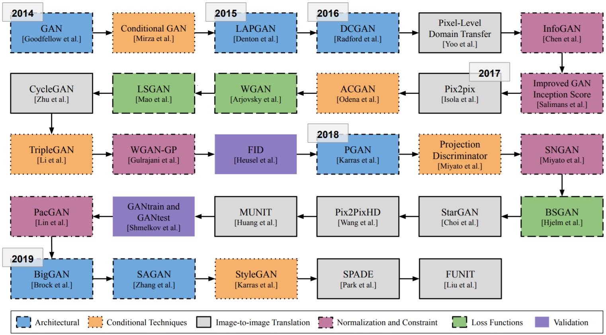

### GAN Network Structure

********

:lemon:  [**GAN**](https://arxiv.org/pdf/1406.2661.pdf)   :date:   2014.06    :blush:  Université de Montréal

#### GAN Principle

   

#### Network

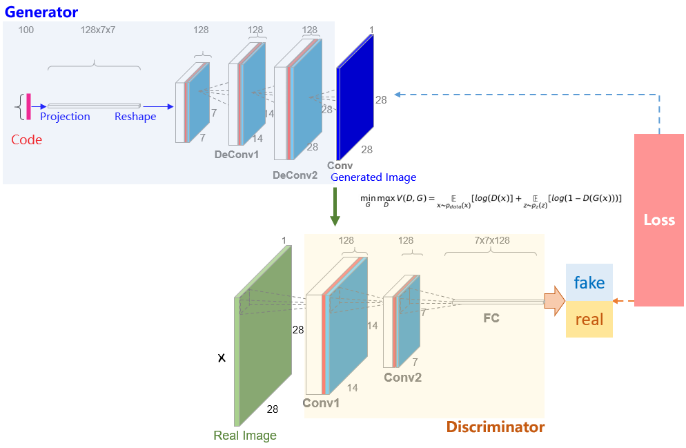

Discriminator
```
_________________________________________________________________
Layer (type)                 Output Shape              Param #
=================================================================
conv2d_1 (Conv2D)            (None, 14, 14, 128)       1280
_________________________________________________________________
leaky_re_lu_1 (LeakyReLU)    (None, 14, 14, 128)       0
_________________________________________________________________
conv2d_2 (Conv2D)            (None, 7, 7, 128)         147584
_________________________________________________________________
leaky_re_lu_2 (LeakyReLU)    (None, 7, 7, 128)         0
_________________________________________________________________
flatten_1 (Flatten)          (None, 6272)              0
_________________________________________________________________
dropout_1 (Dropout)          (None, 6272)              0
_________________________________________________________________
dense_1 (Dense)              (None, 1)                 6273
=================================================================
Total params: 155,137
Trainable params: 155,137
Non-trainable params: 0
_________________________________________________________________
```

Generator
```
_________________________________________________________________
Layer (type)                 Output Shape              Param #
=================================================================
dense_2 (Dense)              (None, 6272)              633472
_________________________________________________________________
leaky_re_lu_3 (LeakyReLU)    (None, 6272)              0
_________________________________________________________________
reshape_1 (Reshape)          (None, 7, 7, 128)         0
_________________________________________________________________
conv2d_transpose_1 (Conv2DTr (None, 14, 14, 128)       262272
_________________________________________________________________
leaky_re_lu_4 (LeakyReLU)    (None, 14, 14, 128)       0
_________________________________________________________________
conv2d_transpose_2 (Conv2DTr (None, 28, 28, 128)       262272
_________________________________________________________________
leaky_re_lu_5 (LeakyReLU)    (None, 28, 28, 128)       0
_________________________________________________________________
conv2d_3 (Conv2D)            (None, 28, 28, 1)         6273
=================================================================
Total params: 1,164,289
Trainable params: 1,164,289
Non-trainable params: 0
_________________________________________________________________
```

GAN
```
_________________________________________________________________
Layer (type)                 Output Shape              Param #
=================================================================
sequential_2 (Sequential)    (None, 28, 28, 1)         1164289
_________________________________________________________________
sequential_1 (Sequential)    (None, 1)                 155137
=================================================================
Total params: 1,319,426
Trainable params: 1,164,289
Non-trainable params: 155,137
_________________________________________________________________
```

#### Implementation 

-  [GAN](https://github.com/taylorguo/GAN_Understanding_Practicing/blob/master/GAN_Practicing/Keras/gan_keras.py)

#### Reference 

- [GAN by Ian J. Goodfellow](https://github.com/goodfeli/adversarial)

********

:lemon:  [**DCGAN**](https://arxiv.org/pdf/1511.06434.pdf)   :date:   2015.11    :blush:  indico Research/Facebook

#### Loss Function 

- 【Binary_Cross_Entropy Loss】    
  
   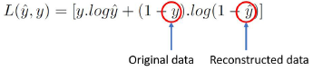
    
- 【Loss Function】    
  <!-- > 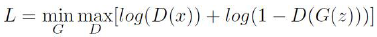  -->

   


#### Network 

   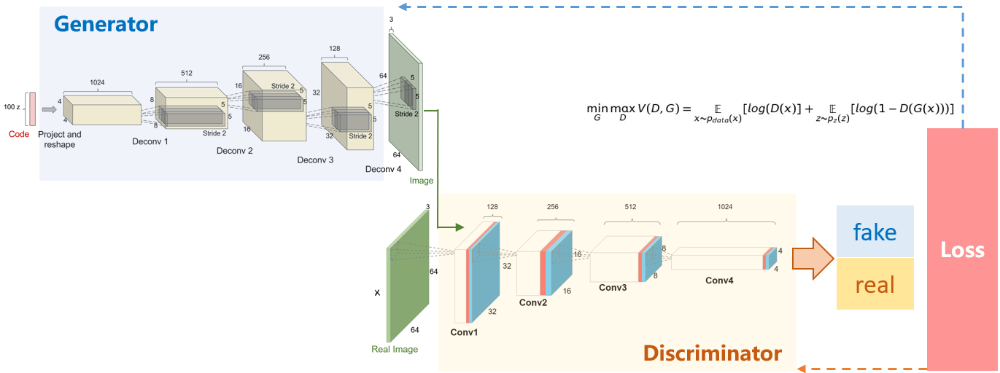

#### Implementation 
<!-- -   [DCGAN tensorflow Official](https://github.com/tensorflow/docs-l10n/blob/master/site/zh-cn/tutorials/generative/dcgan.ipynb) -->

- 

- 

- 

-    


#### Reference 

- [DCGAN TensorFlow2.x Official](https://github.com/tensorflow/docs-l10n/blob/master/site/zh-cn/tutorials/generative/dcgan.ipynb)
- [DCGAN PyTorch](https://github.com/znxlwm/pytorch-MNIST-CelebA-GAN-DCGAN)

********

:lemon:  [**LAPGAN**](https://arxiv.org/pdf/1506.05751.pdf)   :date:   2015.06    :blush:  NYU, Facebook

Deep Generative Image Models using a Laplacian Pyramid of Adversarial Networks

Integrate conditional GAN model into Laplacian Pyramid Framework 

-  将cGAN集成到 Laplacian Pyramid Framework, generator和discriminator都是卷积网络
-  cGAN conditional 是类别信息, 类别的先验分布; 这里的conditional是另一个图像, 从cGAN模型生成的图像
-  Lapacian Pyramid 拉普拉斯高斯金字塔的每一层嵌入cGAN

#### Loss Function 
  
- 【Loss Function】    

   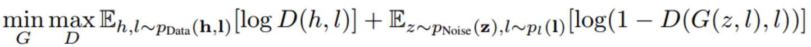


#### Network 

   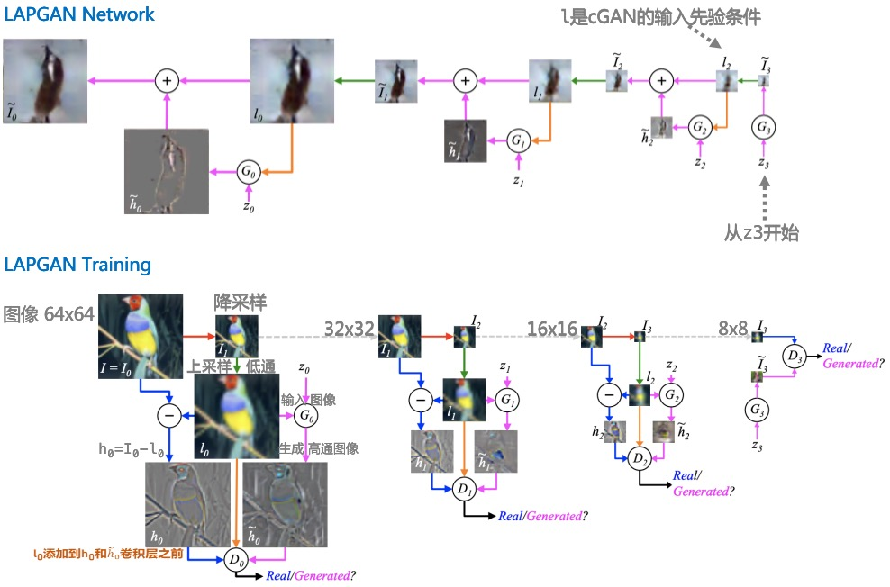

#### Implementation 

- 

- 

- 

-    


#### Reference 

- [LAPGAN TensorFlow](https://github.com/jimfleming/LAPGAN)
- [LAPGAN PyTorch](https://github.com/AaronYALai/Generative_Adversarial_Networks_PyTorch/tree/master/LAPGAN)
- [LAPGAN Network Architecture - Offical](https://gist.github.com/soumith/e3f722173ea16c1ea0d9)
- [图像与滤波](http://www.ruanyifeng.com/blog/2017/12/image-and-wave-filters.html)

********

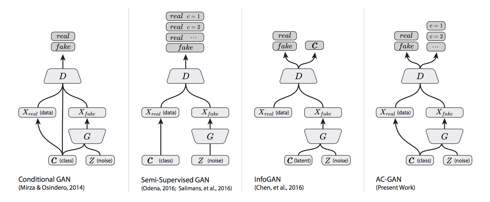

********

:lemon:  [**ConditionalGAN**](https://arxiv.org/pdf/1411.1784.pdf)   :date:    2014.11    :blush:    Université de Montréal/Flickr(Yahoo)

- Log-Likelihood Estimates 对数最大似然估计
- Conditioning the model to direct the data generation process possibly 模型增加条件控制控制数据生成过程; conditioning based on class labels 条件控制是数据类别标签
- Probabilistic one-to-many mapping is instantiated as a conditional predictive distribution, the input is taken to be conditioning variable 输入条件变量可以实现一对多的条件生成分布,从而生成样本

#### Loss Function
- 【Loss Function】    
  
   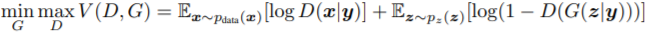

#### Network 

#### Implementation 

- 

- 

- 

-    

#### Reference 

- [cGAN Keras: How to Develop a Conditional GAN (cGAN) From Scratch](https://machinelearningmastery.com/how-to-develop-a-conditional-generative-adversarial-network-from-scratch/)
- [cDCGAN Keras](https://github.com/gaborvecsei/CDCGAN-Keras)

********

:lemon:  [**InfoGAN**](https://arxiv.org/pdf/1606.03657.pdf)   :date:    2016.06

#### Implementation 

- 

- 

- 

-    


********

:lemon:  [**SGAN**](https://arxiv.org/pdf/1606.01583.pdf)   :date:    2016.06

Semi-Supervised Learning with Generative Adversarial Networks

#### Implementation 

- 

- 

- 

-    


********
:lemon:  [**ACGAN**](https://arxiv.org/pdf/1610.09585.pdf)   :date:   2016.10

#### Loss Function 

- 【Binary_Cross_Entropy Loss】    
  
   
    
- 【Loss Function】    

   


#### Network 

   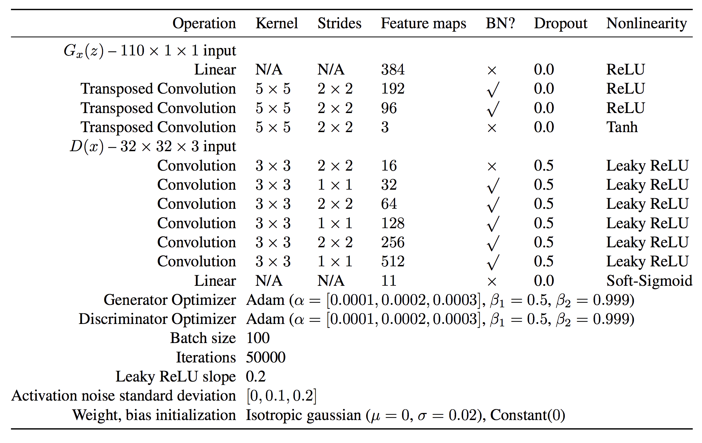

#### Implementation 

- 

- 

- 

-    


#### Reference 

- [DCGAN TensorFlow2.x Official](https://github.com/tensorflow/docs-l10n/blob/master/site/zh-cn/tutorials/generative/dcgan.ipynb)
- [DCGAN PyTorch](https://github.com/znxlwm/pytorch-MNIST-CelebA-GAN-DCGAN)


********

:lemon:  [**LSGAN**](https://arxiv.org/pdf/1611.04076.pdf)   :date:   2016.11

#### Loss Function 

- 【Binary_Cross_Entropy Loss】    
  
   
    
- 【Loss Function】    

   


#### Network 

   

#### Implementation 

- 

- 

- 

-    


********

:lemon:  [**EBGAN**: Energy-based GAN](https://arxiv.org/pdf/1609.03126.pdf)   :date:   2016.11


#### Loss Function 

- 【Binary_Cross_Entropy Loss】    
  
   
    
- 【Loss Function】    

   


#### Network 

   

#### Implementation 

- 

- 

- 

-    


********

:lemon:  [**WassersteinGAN**](https://arxiv.org/pdf/1701.07875.pdf)   :date:    2017.01

#### Implementation 

- 

- 

- 

-    

********

:lemon:  [**WGAN-GP**](https://arxiv.org/pdf/1704.00028.pdf)   :date:    2017.03

#### Implementation 

- 

- 

- 

-  

********
:lemon:  [**SN-GAN**](https://arxiv.org/pdf/1802.05751v3.pdf)   :date:    2018.02

   **Algorithm: SGD with Spectral Normalization**
      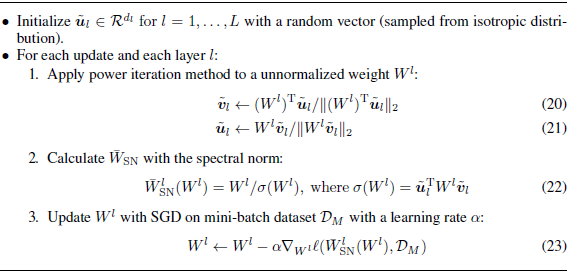
         


   


#### Reference 

- [2017 - Spectral Norm Regularization for Improving the Generalizability of Deep Learning](https://arxiv.org/pdf/1705.10941.pdf)

- [2018 - 【Blog】 - Spectral Normalization Explained](https://christiancosgrove.com/blog/2018/01/04/spectral-normalization-explained.html)

********


:lemon:  [**Image Transformer**](https://arxiv.org/pdf/1802.05751v3.pdf)   :date:    2018.02


********

:lemon:  [**Self-Attention GAN**](https://arxiv.org/pdf/1805.08318.pdf)   :date:    2018.05


#### Network 

- Self-Attention Module: modeling long-range dependencies
- Spectral Normalization in Generator: stabilize GAN training
- TTUR: Speed-up training of regularized discriminator


#### Implementation 
<!-- -   [DCGAN tensorflow Official](https://github.com/tensorflow/docs-l10n/blob/master/site/zh-cn/tutorials/generative/dcgan.ipynb) -->

- 

- 

- 

-    


#### Reference 

- [DCGAN TensorFlow2.x Official](https://github.com/tensorflow/docs-l10n/blob/master/site/zh-cn/tutorials/generative/dcgan.ipynb)
- [DCGAN PyTorch](https://github.com/znxlwm/pytorch-MNIST-CelebA-GAN-DCGAN)


********

:lemon:  [**Progressive Growing GAN**](https://arxiv.org/pdf/1710.10196.pdf)   :date:    2017.10


#### Network 


#### Implementation 

- 

- 

- 

-    


#### Reference 

- [DCGAN TensorFlow2.x Official](https://github.com/tensorflow/docs-l10n/blob/master/site/zh-cn/tutorials/generative/dcgan.ipynb)
- [DCGAN PyTorch](https://github.com/znxlwm/pytorch-MNIST-CelebA-GAN-DCGAN)


********

:lemon:  [**BigGAN**](https://arxiv.org/pdf/1809.11096.pdf)   :date:    2018.09


#### Network 


#### Implementation 

- 

- 

- 

-    


#### Reference 

- [DCGAN TensorFlow2.x Official](https://github.com/tensorflow/docs-l10n/blob/master/site/zh-cn/tutorials/generative/dcgan.ipynb)
- [DCGAN PyTorch](https://github.com/znxlwm/pytorch-MNIST-CelebA-GAN-DCGAN)

********


### Normalization


:lemon:  [**Spatially-Adaptive Normalization**](https://arxiv.org/pdf/1903.07291.pdf)   :date:    2019.03


********


## Dataset

- [Kaggle - CelebA: 200k images with 40 binary attribute](https://www.kaggle.com/jessicali9530/celeba-dataset/data#)
- [CelebA in Google Drive](https://drive.google.com/drive/folders/0B7EVK8r0v71pWEZsZE9oNnFzTm8)

********

## Reference

- [Faster Guaranteed GAN-based Recovery in Linear Inverse Problems](http://www.ima.umn.edu/materials/2019-2020/SW10.14-18.19/28282/IMA2019_Computation_Imaging_Talk_Bresler_Slides.pdf)

- [Generative model](https://en.wikipedia.org/wiki/Generative_model)

- [Lecture 13: Generative Models](http://cs231n.stanford.edu/slides/2017/cs231n_2017_lecture13.pdf)

- [Ian Goodfellow GANs PPT @ NIPS 2016](http://www.iangoodfellow.com/slides/2016-12-04-NIPS.pdf)
