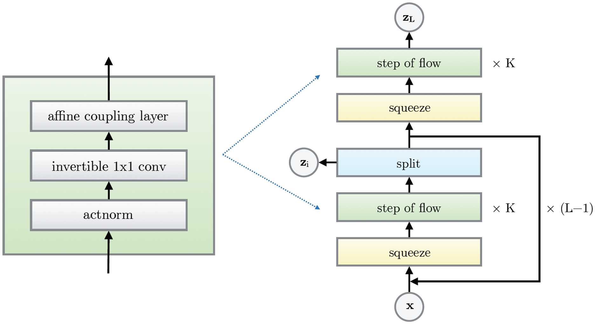
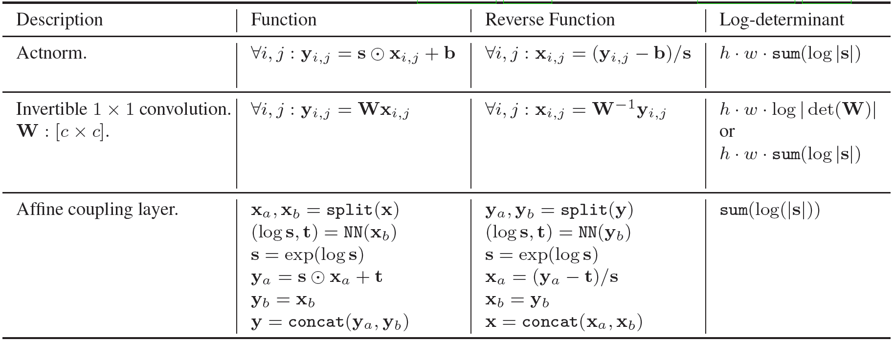

# Generative Model

**目录**

- [Generative Model](#generative-model)
  - [Generative Model based on Likelihood-based method](#generative-model-based-on-likelihood-based-method)
  - [Glow: Generative Flow with Invertible 1x1 Convolutions](#glow-generative-flow-with-invertible-1x1-convolutions)
    - [Flow-based Generative Model](#flow-based-generative-model)
    - [**Glow Architecture**](#glow-architecture)
    - [**Glow Three Components**](#glow-three-components)
    - [**Actnorm**](#actnorm)
    - [**可逆 1x1 卷积**](#可逆-1x1-卷积)
    - [**仿射耦合层**](#仿射耦合层)
  - [参考文献](#参考文献)

## Generative Model based on Likelihood-based method

- Autoregressive models:  simplicity, but limited parallelizability
- Variational auto-encoders (VAE) :  optimize a lower bound on the log-likelihood of the data
- Flow-based generative model :  NICE 中首先介绍,  RealNVP 中进行扩展。

## [Glow: Generative Flow with Invertible 1x1 Convolutions](https://d4mucfpksywv.cloudfront.net/research-covers/glow/paper/glow.pdf)

### Flow-based Generative Model

- 基于log-likelihood , 提取隐变量进行推理。VAE可以推理隐变量近似值的数据点；GAN根本没有encoder来推理隐变量。在可逆生成模型中, 这可以精确推理无需估计。

- 流式生成模型，数据通过一系列可逆的函数变换得到与其对应的隐变量（一一对应关系），而且通过选择合适的可逆函数变换，可以准确计算出训练数据的对数似然。

  

### **Glow Architecture**

### **Glow Three Components**

x 表示输入； y 表示输出；NN() 表示非线性映射

### **Actnorm** 

RealNVP中用到了BN层，而Glow中提出了名为Actnorm的层来取代BN。

所谓Actnorm层事实上只不过是NICE中的尺度变换层的一般化，也就是 缩放平移变换。

$\vec{z}= \frac{z-μ}{σ}$   ,    其中μ, σ都是训练参数。

Glow在论文中提出的创新点是用初始的batch的均值和方差去初始化μ, σ这两个参数，但事实上所提供的源码并没有做到这一点，纯粹是零初始化。

缩放平移的加入，确实有助于更好地训练模型。

由于Actnorm的存在，仿射耦合层的尺度变换已经显得不那么重要了。

相比于加性耦合层，仿射耦合层多了一个尺度变换层，从而计算量翻了一倍。

但事实上相比加性耦合，仿射耦合效果的提升并不高（尤其是加入了Actnorm后），所以要训练大型的模型，为了节省资源，一般都只用加性耦合，比如Glow训练256x256的高清人脸生成模型，就只用到了加性耦合。

### **可逆 1x1 卷积**

可逆1x1卷积源于 对置换操作的一般化。

在flow模型中，一步很重要的操作就是将各个维度重新排列，NICE 是简单反转，而 RealNVP 则是随机打乱。

不管是哪一种，都对应着向量的置换操作。

事实上，对向量的置换操作，可以用矩阵乘法来描述，比如原来向量是[1,2,3,4]，分别交换第一、二和第三、四两个数，得到[2,1,4,3]，

这个操作可以用矩阵乘法来描述：

$$
\begin{pmatrix} 2 \\1\\4\\3\\  \end{pmatrix} =   \begin{pmatrix} 0&&1&&0&&0 \\1&&0&&0&&0\\0&&0&&0&&1\\0&&0&&1&&0\\  \end{pmatrix} \begin{pmatrix} 1 \\2\\3\\4\\  \end{pmatrix}
$$

右端第一项是“由单位矩阵不断交换两行或两列最终得到的矩阵”，称为置换矩阵。

将置换矩阵换成一般的可训练的参数矩阵呢？ 1x1可逆卷积就是这么来的。

flow模型提出时就已经明确指出，flow模型中的变换要满足两个条件：一是可逆，二是雅可比行列式容易计算。

如果直接写出变换:  h = xW

那么它就只是一个普通的没有bias的全连接层，并不能满足这两个条件。

为此，要做一些准备工作。

首先，我们让h和x的维度一样，也就是说W是一个方阵，这是最基本的设置；

其次，由于这只是一个线性变换，因此它的雅可比矩阵就是[∂h/∂x]=W，所以它的行列式就是det W，因此我们需要把−log|detW|这一项加入到loss中；

最后，初始化时为了保证W的可逆性，一般使用“随机正交矩阵”初始化。

Glow的论文做了对比实验，表明相比于直接反转，shuffle能达到更低的loss，

而相比shuffle，可逆1x1卷积能达到更低的loss。

可逆1x1卷积虽然能降低loss，但是有一些要注意的问题。

第一，loss的降低不代表生成质量的提高，

比如A模型用了shuffle，训练200个epoch训练到loss=-50000，

B模型用了可逆卷积，训练150个epoch就训练到loss=-55000，

那么通常来说在当前情况下B模型的效果还不如A（假设两者都还没有达到最优）。

事实上可逆1x1卷积只能保证大家都训练到最优的情况下，B模型会更优。

第二，简单实验中发现，用可逆1x1卷积达到饱和所需要的epoch数，要远多于简单用shuffle的epoch数。

### **仿射耦合层**

[**NICE**](https://arxiv.org/pdf/1410.8516.pdf) 中，提出了加性耦合层，也提到了乘性耦合层，不过没有用上；

在 **[RealNVP](https://arxiv.org/pdf/1605.08803.pdf)**，加性和乘性耦合层结合在一起，成为一个一般的“仿射耦合层”。

h1 = x1
h2 = s(x1) ⊗ x2 + t(x1)

s, t 都是x1的向量函数，形式上第二个式子对应于x2的一个仿射变换，因此称为“仿射耦合层”。
仿射耦合的雅可比矩阵依然是一个三角阵，但对角线不全为1，用分块矩阵表示为:

## 参考文献

- [RealNVP与Glow：流模型的传承与升华](https://kexue.fm/archives/5807)

